# Alur Pengguna per Modul (User Flow)

Dokumen ini merangkum **alur pengguna**, **contoh data realistis**, dan **validasi yang dipakai**
untuk setiap modul Inventra (sistem manajemen aset tetap bank). Isi diambil langsung dari kode
backend (binding tag DTO, sentinel error, enum migrasi, dan aturan bisnis di `service.go`), sehingga
menjadi rujukan yang selaras dengan implementasi, bukan asumsi.

Basis path semua endpoint: `/api/v1`. Format detail lengkap tetap di `backend/api/openapi.yaml`.

Setiap modul dilengkapi **diagram Mermaid** (sequence / state / flowchart) yang ter-render otomatis di
GitHub, Obsidian vault, dan penampil Markdown yang mendukung Mermaid.

---

## 0. Konvensi umum

### Peran bawaan dan cakupan data (scope) default

| Kode role | Nama | Scope default (`*`) |
|---|---|---|
| `superadmin` | Superadmin | `global` |
| `kepala_kanwil` | Kepala Kanwil | `office_subtree` |
| `kepala_unit` | Kepala Unit | `office_subtree` |
| `manager` | Manager | `office_subtree` |
| `staf` | Staf | `own` |

Tiga lapis otorisasi (semua data-driven, di-cache Redis, kunci `role_id`):
1. **Izin aksi** (RBAC) - kunci boolean seperti `asset.manage`, `request.decide`.
2. **Cakupan data** (data scope) - `global` / `office_subtree` / `office` / `own`, per modul.
3. **Izin field** - view/edit per `(entity, field, role)`; default-allow, tetapi **fail-closed** (500)
   bila lookup kebijakan gagal, sehingga kolom sensitif (mis. `purchase_cost`) tidak pernah bocor.

### Katalog izin aksi (RBAC keys)

`user.manage`, `role.manage`, `scope.manage`, `fieldperm.manage`, `audit.view`,
`masterdata.global.manage`, `masterdata.office.manage`, `masterdata.employee.manage`,
`asset.view`, `asset.manage`, `request.create`, `request.decide`, `approval.config.manage`,
`transfer.view/manage`, `disposal.view/manage`, `depreciation.view/manage`, `assignment.view/manage`,
`stockopname.view/manage`, `maintenance.view/manage`, `report.view`, `report.export`,
`valuation.exclude.approve`.

### Aturan lintas modul

- **Envelope list**: `GET` daftar mengembalikan `{data, total, limit, offset}`. `limit` default 20,
  di-clamp 1 sampai 100; `offset` default 0.
- **Uang sebagai string**: kolom `numeric(18,2)` dipetakan ke Go `string` (mis. `"18500000.00"`) untuk
  menghindari galat presisi float. Selalu kirim/terima nilai uang sebagai string.
- **Soft delete**: semua entitas punya `deleted_at`; `UNIQUE` berupa partial index
  `WHERE deleted_at IS NULL` sehingga kode/email bisa dipakai ulang setelah dihapus.
- **Pemetaan galat DB umum**: `23505` konflik (409), `23503` referensi tidak valid (400),
  no-rows tidak ditemukan (404).
- **Format galat validasi**: kegagalan `binding` tag mengembalikan 400 dengan pesan validasi Gin.
- **Web-only (ADR-0017)**: token audiens `mobile` ditolak pada ekspor laporan, seluruh modul impor,
  dan seluruh modul administrasi otorisasi (`RequireAudience(web)`).

---

## 1. Autentikasi dan Sesi (identity / auth / oauth)

**Tujuan**: login, refresh token, kelola profil sendiri, kelola sesi perangkat.
**Izin**: tidak ada `RequirePermission` - setiap rute yang terautentikasi self-scoped ke pemanggil.

### Endpoint utama

| Method | Path | Middleware |
|---|---|---|
| POST | `/auth/login` | publik + rate limit per IP dan per akun |
| POST | `/auth/refresh` | publik + rate limit |
| GET | `/auth/google`, `/auth/google/callback` | publik (OIDC + PKCE) |
| POST | `/auth/password/forgot`, `/auth/password/reset` | publik |
| POST | `/auth/logout` | RequireAuth |
| GET | `/auth/me`, `/auth/permissions`, `/auth/scope/:module` | RequireAuth |
| GET/PUT | `/auth/profile` | RequireAuth |
| PUT | `/auth/password` | RequireAuth |
| GET/POST/DELETE | `/auth/avatar` | RequireAuth (multipart `file`, JPG/PNG, maks 2 MiB) |
| POST | `/auth/email/change-request`, `/auth/password/change-request` | RequireAuth |
| GET/DELETE | `/auth/sessions`, `/auth/sessions/:id`, `/auth/sessions/revoke-others` | RequireAuth |

### Validasi (binding tag verbatim)

| DTO | Field | Aturan |
|---|---|---|
| loginRequest | `email` | `required,email` |
| | `password` | `required` |
| resetPasswordRequest | `token` | `required` |
| | `new_password` | `required,min=8` |
| changePasswordRequest | `old_password` | `required` |
| | `new_password` | `required,min=8` |
| updateProfileRequest | `name` | `required` |
| | `phone` | (tanpa tag; kosong = hapus nomor pegawai tertaut) |
| emailChangeRequest | `new_email` | `required,email` |
| | `current_password` | `required` |
| forgotPasswordRequest | `email` | `required,email` |

Parameter TTL: access token **15 menit**, refresh token **7 hari**, token reset/ubah-email **30 menit**,
state OAuth **5 menit**. Rate limit login 5/menit per akun, 20/menit per IP.

### Aturan bisnis (sentinel error)

- `ErrInvalidCredentials` (401): email tidak dikenal, akun Google-only tanpa password, atau bcrypt
  tidak cocok. Pada ganti password/email dipetakan **400** (bukan 401) agar interceptor "token
  kedaluwarsa" di frontend tidak ikut terpicu.
- `ErrInvalidToken` (401): JWT rusak/kedaluwarsa, JTI refresh tidak di-whitelist Redis, sesi dicabut,
  atau token diterbitkan sebelum `password_changed_at` (epoch password).
- `ErrUserInactive` (403): status bukan `active`.
- `ErrWeakPassword` (400): password baru kurang dari 8 karakter (dicek ganda di service).
- `ErrEmailInUse` / `ErrSameEmail` (409): pada ubah email.
- **Anti-enumerasi**: `password/forgot` selalu 200 walau email tidak ada/nonaktif/Google-only.
- Ganti/reset password mencabut **semua** sesi perangkat (logout menyeluruh).
- Login Google **hanya menautkan** ke akun aktif yang sudah ada; tidak pernah membuat user baru.
  (Catatan implementasi: hashing password memakai **bcrypt**, `bcrypt.DefaultCost`.)

### Contoh data

```json
POST /api/v1/auth/login
{ "email": "budi.santoso@inventra.local", "password": "RahasiaBTN2026" }
```
```json
PUT /api/v1/auth/profile
{ "name": "Budi Santoso", "phone": "081234567890" }
```

### Alur pengguna

1. Staf mengirim email dan password ke `POST /auth/login`. Sistem verifikasi bcrypt, cek status
   `active`, menerbitkan access + refresh + `sid`, membuka sesi perangkat (web: refresh token sebagai
   cookie HttpOnly; mobile: refresh token di body).
2. Frontend memanggil `/auth/me`, `/auth/permissions`, `/auth/scope/:module` untuk bootstrap identitas
   dan otorisasi.
3. Access token kedaluwarsa (15 menit), `POST /auth/refresh` merotasi refresh token pada sesi yang sama.
4. Layanan mandiri: ubah profil, avatar, password, atau alur verifikasi email.
5. Kelola perangkat via `/auth/sessions`; `POST /auth/logout` mendenylist JTI access dan menutup sesi.

### Diagram

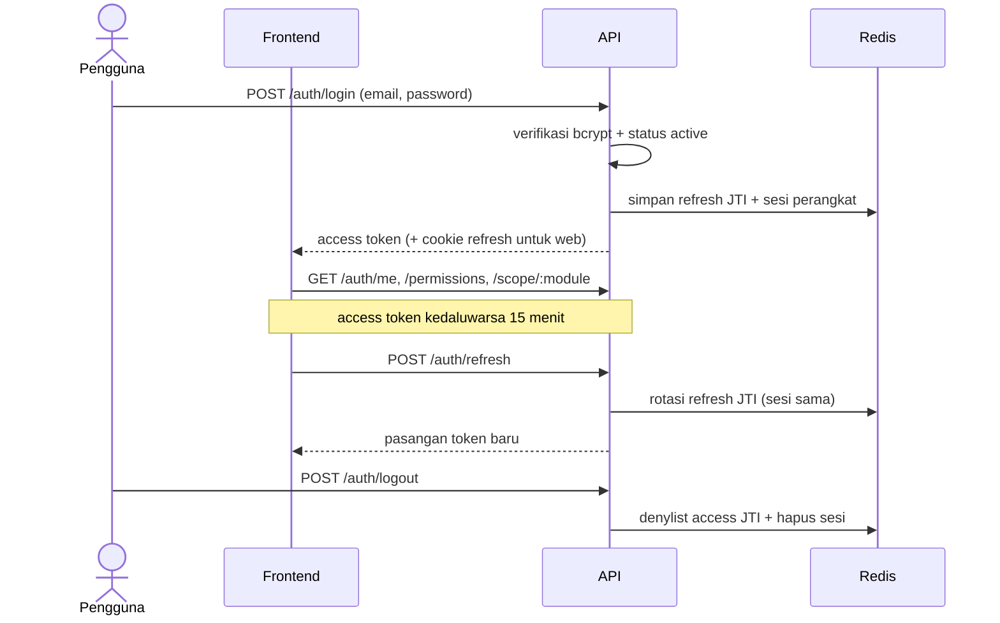

---

## 2. Manajemen User (user)

**Tujuan**: superadmin membuat/mengubah/menonaktifkan user.
**Izin**: seluruh grup `/users` digerbang `user.manage` (permukaan superadmin, tidak per-office).

### Endpoint

`GET /users` (filter `search`, `role_id`, `office_id`, `status`), `POST /users`, `GET /users/:id`,
`PUT /users/:id`, `DELETE /users/:id` (soft delete), `POST /users/:id/reset-password`.

### Validasi (binding tag verbatim)

| DTO | Field | Aturan |
|---|---|---|
| createUserRequest | `name` | `required` |
| | `email` | `required,email` |
| | `password` | (tanpa tag; kosong = akun Google-only) |
| | `role_id` | `required,uuid` |
| | `office_id` | `omitempty,uuid` |
| | `employee_id` | `omitempty,uuid` |
| updateUserRequest | `name` | `required` |
| | `role_id` | `required,uuid` |
| | `status` | `required,oneof=active inactive suspended` |
| | `office_id` | `omitempty,uuid` |
| | `employee_id` | `omitempty,uuid` |

### Aturan bisnis

- `ErrEmailExists` (409) pada duplikasi email; `ErrInvalidReference` (400) pada FK role/office/employee
  tidak valid; `ErrNotFound` (404).
- Response melewati `FieldService.FilterEntity("users", ...)` (fail-closed 500); `password_hash` dan
  `google_id` tidak pernah diserialisasi (hanya `google_linked` dan `has_avatar`).
- Reset password admin **tidak menyetel** password - hanya mengirim tautan sekali-pakai ke user;
  akun Google-only ditolak (422).

### Contoh data

```json
POST /api/v1/users
{ "name": "Budi Santoso", "email": "budi.santoso@inventra.local",
  "password": "SandiAwalBTN2026", "role_id": "8f1c2d3e-...", "office_id": "1a2b3c4d-...",
  "employee_id": "2b3c4d5e-..." }
```

### Alur pengguna

1. Superadmin membuka Manajemen User; `GET /users` menampilkan halaman ter-mask.
2. `POST /users` menetapkan role + office/employee opsional (password boleh kosong untuk Google-only).
3. Edit via `PUT /users/:id` (ganti penuh name/role/status/office/employee), tercatat di audit.
4. `POST /users/:id/reset-password` mengirim tautan reset; admin tidak melihat password.
5. `DELETE /users/:id` soft delete (email jadi bisa dipakai ulang).

### Diagram

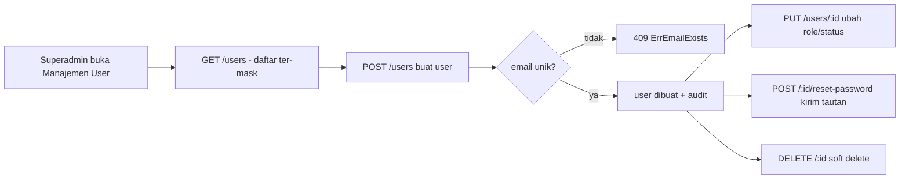

---

## 3. Master Data (offices / categories / employees / floors / rooms / reference)

**Izin tulis**: `masterdata.office.manage` (office, floor, room, employee) atau
`masterdata.global.manage` (category dan semua resource referensi). Semua `GET` cukup terautentikasi.

### 3.1 Kantor (office) - scope module `"offices"`

Endpoint: `GET /offices`, `/offices/tree`, `/offices/map`, `/offices/:id`, `POST/PUT/DELETE /offices/:id`.

Validasi (`Request`):

| Field | Aturan |
|---|---|
| `parent_id` | `omitempty,uuid` |
| `office_type_id` | `required,uuid` |
| `province_id`, `city_id` | `omitempty,uuid` |
| `name`, `code` | `required` |
| `latitude` | `omitempty,min=-90,max=90` |
| `longitude` | `omitempty,min=-180,max=180` |
| `is_active` | (opsional; default `true`) |

Aturan: `ErrParentOutOfScope` (403) - pemanggil ber-scope wajib memberi `parent_id` dalam scope-nya;
global boleh membuat kantor akar. `ErrReparentOutOfScope` (403) pada pindah parent ke luar scope.
Scope ditegakkan pada **semua** verb (baca dan tulis).

```json
POST /api/v1/offices
{ "parent_id": "8f3b1c20-...", "office_type_id": "2a6c9d10-...", "province_id": "d1e2f3a4-...",
  "city_id": "b7c8d9e0-...", "name": "Kantor Cabang Bandung", "code": "KC-BDG-001",
  "address": "Jl. Asia Afrika No. 12, Bandung", "is_active": true,
  "latitude": -6.921151, "longitude": 107.607483 }
```

Alur: pilih tipe kantor + provinsi/kota + parent (dari `/offices/tree`), lalu `POST /offices`.
`/offices/map` memberi data Peta Lokasi (geo + jumlah aset).

### 3.2 Kategori aset (category) - global, tanpa scope

Endpoint: `GET /categories`, `/categories/tree`, `/categories/:id`, `POST/PUT/DELETE`.

Validasi (`Request`):

| Field | Aturan |
|---|---|
| `name` | `required` |
| `parent_id` | `omitempty,uuid` |
| `default_depreciation_method` | `omitempty,oneof=straight_line declining_balance` |
| `asset_class` | `omitempty,oneof=tangible intangible` (default `tangible`) |
| `default_fiscal_group` | `omitempty,oneof=kelompok_1 kelompok_2 kelompok_3 kelompok_4 bangunan_permanen bangunan_non_permanen non_susut` |
| `code`, `default_useful_life_months`, `default_salvage_rate`, `default_fiscal_life_months`, `gl_account_code`, `capitalization_threshold` | (tanpa tag) |

Kategori menyimpan default akuntansi/pajak yang nanti mengisi field depresiasi/fiskal aset.

```json
POST /api/v1/categories
{ "name": "Perangkat IT", "code": "CAT-IT", "default_depreciation_method": "straight_line",
  "default_useful_life_months": 48, "asset_class": "tangible", "default_fiscal_group": "kelompok_1",
  "default_fiscal_life_months": 48, "gl_account_code": "1520.10",
  "capitalization_threshold": "1000000.00", "is_active": true }
```

### 3.3 Pegawai (employee) - scope module `"employees"`, response ter-mask field

Validasi (`Request`):

| Field | Aturan |
|---|---|
| `code`, `name` | `required` |
| `email` | `omitempty,email` |
| `office_id` | `required,uuid` |
| `department_id`, `position_id` | `omitempty,uuid` |
| `status` | `omitempty,oneof=active inactive suspended` (default `active`) |

Aturan: `ErrOfficeOutOfScope` (403) pada create/update jika `office_id` di luar scope pemanggil.

```json
POST /api/v1/employees
{ "code": "EMP-2024-0157", "name": "Siti Nurhaliza", "email": "siti.nurhaliza@inventra.local",
  "phone": "081234567890", "office_id": "8f3b1c20-...", "status": "active" }
```

### 3.4 Lantai (floor) dan Ruangan (room) - scope module `"offices"`

Floor validasi: `office_id` `required,uuid`, `name` `required`, `level` opsional.
`GET /floors` **wajib** query `office_id` (UUID valid).

Room validasi: `floor_id` `required,uuid`, `name` `required`, `code` opsional.
`GET /rooms` **wajib** query `floor_id`. Scope ruangan mengikuti office lantainya
(`ErrFloorOutOfScope` 403).

```json
POST /api/v1/floors  { "office_id": "8f3b1c20-...", "name": "Lantai 2", "level": 2 }
POST /api/v1/rooms   { "floor_id": "e5f6a7b8-...", "name": "Ruang Server", "code": "SRV-L2-01" }
```

### 3.5 Data referensi (reference engine) - global, deklaratif

Satu mesin CRUD generik melayani resource datar dengan pola 5-rute identik per path. Validasi dilakukan
oleh `coerce` (bukan gin binding): field `Required` wajib, `enum` harus dari himpunan yang diizinkan,
`uuid` harus valid. Resource: `office-types` (tier `pusat|wilayah|office`), `departments`, `positions`,
`units`, `maintenance-categories`, `problem-categories`, `brands`, `vendors`, `provinces`, `cities`
(butuh `province_id`), `models` (butuh `brand_id`).

```json
POST /api/v1/brands  { "name": "Cisco", "is_active": true }
POST /api/v1/models  { "brand_id": "9a8b7c6d-...", "name": "Catalyst 9300", "is_active": true }
POST /api/v1/cities  { "province_id": "d1e2f3a4-...", "name": "Kota Bandung", "code": "3273" }
```

Alur master data umum: buat parent lebih dulu (provinsi sebelum kota, brand sebelum model), pilih dari
dropdown referensi, lalu buat resource kompleks (office/employee/category). Setiap tulis tercatat audit.

### Diagram

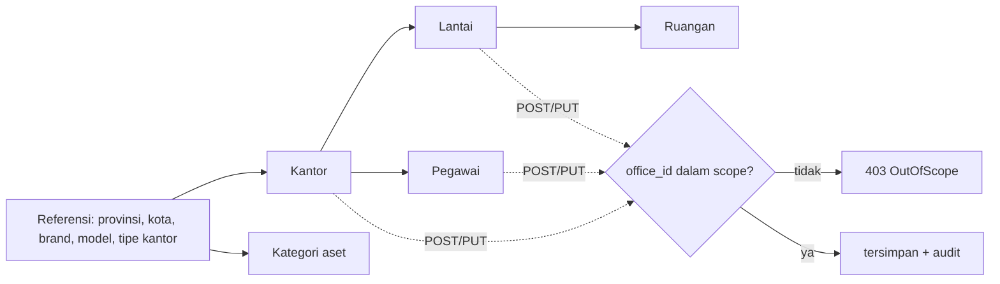

---

## 4. Aset (asset / barcode / search)

**Penting**: **tidak ada `POST /assets`**. Pembuatan aset menempuh **modul approval**
(`POST /requests` tipe `asset_create`) atau **impor CSV**. Edit dan lampiran memakai rute aset langsung.
**Izin**: `asset.view` (baca) dan `asset.manage` (tulis).

### Endpoint utama

`GET /assets` (scoped, ter-mask), `GET /assets/by-tag/:tag` (di luar scope balas 404, anti-enumerasi),
`GET /assets/:id`, `GET /assets/:id/barcode?type=code128|qr`, `POST /assets/labels`, `PUT /assets/:id`,
lampiran (`POST/GET/DELETE /assets/:id/attachments`), dokumen BAST
(`/assets/:id/documents` CRUD + `/file`).

### Validasi

`AssetUpdateRequest` (body `PUT /assets/:id`; `purchase_cost`, `asset_class`, `status` sengaja
dikecualikan - ditangani operasi khusus):

| Field | Aturan |
|---|---|
| `name` | `required` |
| `category_id` | `required,uuid` |
| `brand_id`, `model_id`, `room_id`, `unit_id`, `vendor_id` | `omitempty,uuid` |
| `serial_number`, `po_number`, `funding_source`, `purchase_date`, `warranty_expiry`, `notes` | (tanpa tag; tanggal `YYYY-MM-DD`) |

Dokumen (`DocumentCreateRequest`): `doc_type`
`required,oneof=bast_acquisition bast_transfer bast_disposal invoice contract other`,
`related_request_id` `omitempty,uuid`.

Lampiran (multipart `file`): MIME diizinkan `image/jpeg`, `image/png`, `image/webp`, `application/pdf`
(lainnya 415), ukuran maks `AttachmentMaxBytes` (413).

Label (`POST /assets/labels`, divalidasi imperatif): wajib `asset_ids` atau `tags`; total maks **500**;
`template` (btn default/generic), `layout` (roll default/sheet), `mode` (barcode default/qr/both),
`size` preset (`60x24`/`50x30`/`70x40`/`100x50`); preset tak dikenal 400.

Search (`GET /search?q=`): minimal **2** karakter (trim), maks 5 item per grup.

### Aturan bisnis dan enum

- `shared.asset_status`: `available` (default), `assigned`, `under_maintenance`, `in_transfer`,
  `retired`, `disposed`, `lost`. Transisi valid (`ValidTransition`): `available` ke
  `assigned|under_maintenance|lost|disposed`; `assigned` ke `available|lost|disposed`;
  `under_maintenance` ke `available|disposed`. Selain itu `ErrInvalidState` (422).
- **Asset tag / NUP**: format `<kodeKantor>-<kodeKategori>-<tahun>-<urut 5 digit>`, mis.
  `JKT01-PIT-2026-00001`. Dibangkitkan atomik saat approval (counter per office+category+tahun).
- `asset_class=tangible` **wajib** punya `room_id` (CHECK DB); pelanggaran `ErrRoomRequired` (400).
- `purchase_cost` (numeric string) dan kolom nilai lain ter-mask izin field, fail-closed.
- `capitalized` default `true`; ambang kapitalisasi ada di kategori
  (`capitalization_threshold`).

### Contoh data (pembuatan via approval)

```json
POST /api/v1/requests
{ "type": "asset_create", "amount": "18500000", "office_id": "b2c3d4e5-...",
  "reason": "Pengadaan laptop untuk staf IT cabang",
  "payload": { "name": "Dell Latitude 5440", "category_id": "7a1e9c34-...",
    "office_id": "b2c3d4e5-...", "room_id": "c9d8e7f6-...", "asset_class": "tangible",
    "purchase_cost": "18500000", "purchase_date": "2026-07-15",
    "serial_number": "DL5440-2026-0071", "vendor_id": "d0e1f2a3-...", "po_number": "PO-2026-00458",
    "funding_source": "APBN 2026", "warranty_expiry": "2029-07-15",
    "notes": "Laptop dinas - Kantor Cabang Jakarta" } }
```
Catatan: `office_id` harus muncul di level atas **dan** di `payload` dan sama (tamper-check executor);
`amount` harus sama dengan `payload.purchase_cost` (anti-understatement).

### Alur pengguna

1. Maker (ber-`asset.manage`) submit `POST /requests` tipe `asset_create`. Belum ada baris aset.
2. Maker-checker menyetujui sesuai tier nilai; pada persetujuan final executor membangkitkan tag dan
   `CreateAsset` (status `available`, `capitalized=true`) dalam satu transaksi.
3. Perawatan opsional: `PUT /assets/:id`, lampiran foto/PDF, metadata dokumen BAST/invoice.
4. Cetak label/QR via `POST /assets/labels` atau `GET /assets/:id/barcode`; pindai tag resolve via
   `GET /assets/by-tag/:tag`.

### Diagram

Alur pembuatan aset (lewat approval):

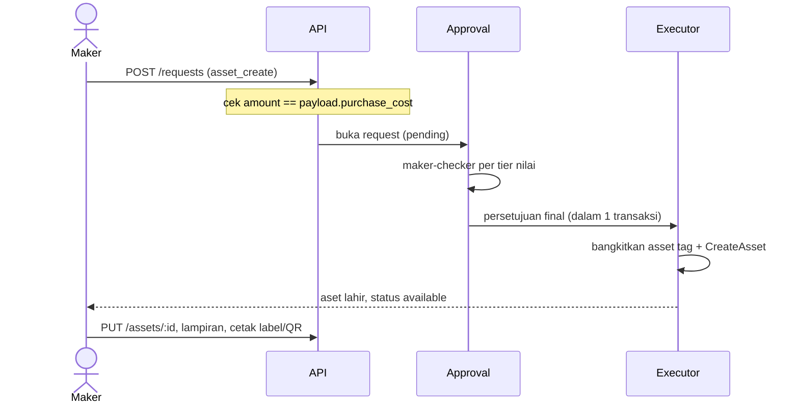

Transisi status aset (`ValidTransition`):

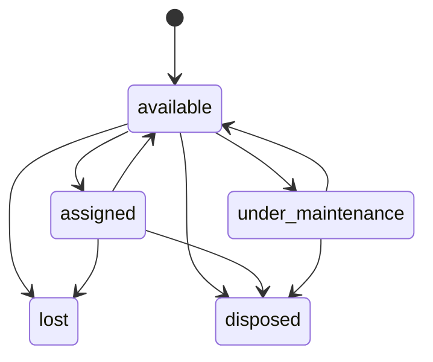

---

## 5. Persetujuan / Maker-Checker (approval)

**Tujuan**: rantai persetujuan berjenjang berdasarkan nilai, dengan segregation of duties (SoD).
**Izin**: `request.create` (ajukan), `request.decide` (putuskan), `approval.config.manage` (ambang).

> Untuk skenario lengkap "siapa maker dari kantor apa, approver siapa dari kantor apa, apa yang boleh
> dan tidak boleh" per modul, lihat **Lampiran A** di akhir dokumen.

### Endpoint

`POST /requests`, `GET /requests`, `GET /requests/inbox`, `GET /requests/inbox/count`,
`GET /requests/:id`, `POST /requests/:id/approve|reject|cancel`,
`GET /approval-thresholds/preview`, dan CRUD `/approval-thresholds`.

### Validasi

`SubmitRequest`: `type` `required,oneof=asset_create asset_disposal valuation_exclusion` (mutasi dan
peminjaman **tidak** lewat sini - punya rute domain sendiri), `amount` `required`, `office_id`
`required`, `payload`/`target_id`/`reason` opsional. `office_id`/`target_id` harus UUID; untuk
`asset_create`, `amount` wajib sama dengan `payload.purchase_cost`.

`DecideRequest`: `decision` `required,oneof=approve reject`, `note` opsional (alasan). Approve/reject
dirutekan lewat path, `note` yang dipakai.

`ThresholdRequest`: `request_type` `required` (harus salah satu dari 6 tipe), `amount_from`
`required`, `required_level` `required` (harus `office|office_subtree|wilayah|pusat`), `step_order`
`required`, `amount_to`/`is_active` opsional.

### Aturan bisnis

- **SoD dua lapis**: CHECK DB `decided_by_id <> requested_by_id` **dan** `eligibleToDecide`
  (`ErrSelfApproval` bila pemanggil = maker atau sudah jadi approver di langkah sebelumnya).
- **Tier nilai** (`approval_thresholds`, dipilih `MatchThresholdSteps`). Band bawaan:
  - `asset_create`: 0-10jt office; 10-100jt office+wilayah; 100jt+ office+wilayah+pusat.
  - `asset_disposal`: 0-5jt office; 5-50jt office+wilayah; 50jt+ office+wilayah+pusat.
  - `asset_transfer`: 0-50jt office; 50jt+ office+wilayah.
  - `assignment`: 0+ office (satu langkah, tidak ber-tier).
  - `valuation_exclusion`: 0+ wilayah.
- **Executor** dijalankan pada persetujuan final, dalam transaksi yang sama dengan pembalikan status
  (efek samping atomik dengan approval).
- **Status**: `pending` -> (approve tiap langkah menaikkan `current_step`) -> `approved` (jalankan
  executor) / `rejected` (terminal) / `cancelled` (maker-only, pending-only). Row-lock mencegah dua
  approver melewati langkah yang sama.

### Contoh data

```json
POST /api/v1/requests/{id}/approve
{ "decision": "approve", "note": "Disetujui, anggaran tersedia dan sesuai kebutuhan operasional" }
```

### Alur pengguna

1. Maker submit (via `/requests` atau rute domain). Rantai langkah dibangun dari band nilai; status
   `pending`.
2. Approver menemukan tugas via `GET /requests/inbox` (difilter ke langkah yang boleh diputus).
3. Approve: SoD dan scope tier ditegakkan. Langkah non-final menaikkan `current_step`; langkah final
   menjalankan executor. Reject mengakhiri; maker boleh cancel selagi pending.

### Diagram

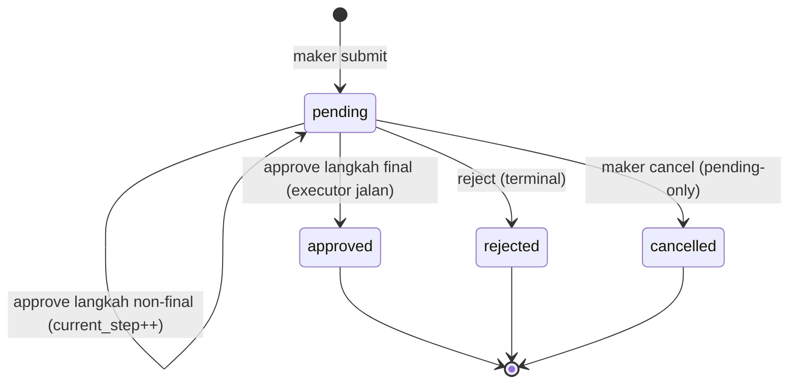

---

## 6. Penugasan dan Peminjaman Aset (assignment)

**Izin**: `assignment.manage` (check-out/check-in langsung oleh Manager), `assignment.view`,
`request.create` (peminjaman mandiri Staf). Catatan desain: Staf **tidak** menerima `assignment.view`,
sehingga picker peminjaman/`available`/`mine` digerbang `request.create`; `mine` meresolusi employee
dari JWT (Staf tak bisa mengintip milik rekan).

### Endpoint

`GET /assignments`, `/assignments/available`, `/assignments/mine`, `/assignments/:id`,
`POST /assignments` (check-out Manager), `POST /assignments/borrow` (ajuan Staf),
`POST /assignments/:id/checkin`, `GET /assets/:id/assignments`.

### Validasi

`CheckoutRequest`: `asset_id` `required,uuid`, `employee_id` `required,uuid`, `checkout_date`
`required` (`YYYY-MM-DD`), `due_date`/`condition_out`/`notes` opsional.
`BorrowRequest`: `asset_id` `required,uuid`, `due_date`/`condition_out`/`notes` opsional.
`CheckinRequest`: `checkin_date` opsional (default hari ini), `condition_in` opsional,
`needs_maintenance` bool.

### Aturan bisnis

- Peminjaman Staf membuka approval tipe `assignment` (amount `"0"`, satu langkah level office).
  Handler pra-cek pemanggil punya employee tertaut (`ErrNoEmployee` 422).
- Executor (`assignmentExec`) meresolusi employee peminjam, cek ulang aset masih `available`, sisip
  assignment, dan flip aset ke `assigned` (`assigned_by` = approver).
- Check-in: assignment jadi `returned`, aset kembali `available` (atau `under_maintenance` jika
  `needs_maintenance`).
- Check-out Manager melakukan langkah pengajuan-persetujuan-eksekusi dalam satu panggilan (tanpa approval).

### Contoh data

```json
POST /api/v1/assignments
{ "asset_id": "5f1c2e3a-...", "employee_id": "9a8b7c6d-...", "checkout_date": "2026-07-21",
  "due_date": "2026-08-21", "condition_out": "baik", "notes": "Laptop dinas untuk Budi Santoso" }
```
```json
POST /api/v1/assignments/borrow
{ "asset_id": "5f1c2e3a-...", "due_date": "2026-08-21", "condition_out": "baik" }
```

### Diagram

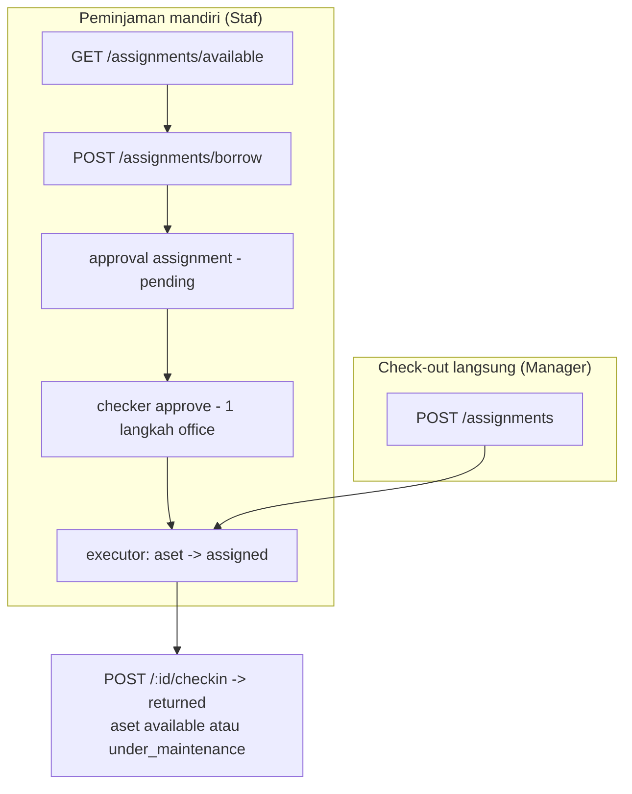

---

## 7. Mutasi Aset (transfer)

**Izin**: `transfer.manage` (ajukan/kirim/terima), `transfer.view`.

### Endpoint

`GET /transfers`, `GET /transfers/:id`, `POST /transfers` (ajukan mutasi),
`POST /transfers/:id/ship|receive|reject-receive`, `GET /assets/:id/transfers`.

### Validasi

`SubmitRequest`: `asset_id` `required,uuid`, `to_office_id` `required,uuid`, `to_room_id`
`omitempty,uuid`, `condition_sent` `omitempty,oneof=baik rusak_ringan rusak_berat`,
`reason`/`transfer_date` opsional (kantor asal diturunkan server dari aset).
`ReceiveRequest` (JSON atau multipart, BAST): `bast_no`, `received_date`, `to_room_id`
`omitempty,uuid`.

### Aturan bisnis

- Submit memvalidasi aset dalam scope, `available`, tujuan beda dari asal (`ErrSameOffice`), tak ada
  mutasi terbuka lain (`ErrAssetInTransit`). Membuka approval `asset_transfer` (amount = purchase_cost).
- `shared.transfer_status`: `pending`, `approved`, `in_transit`, `received`, `rejected`, `cancelled`,
  `returned`. Executor membuat baris transfer `approved`; `ship` -> `in_transit`; `receive` ->
  `received` (aset dipindah atomik, BAST dicatat best-effort); `reject-receive` -> `returned`.

### Contoh data

```json
POST /api/v1/transfers
{ "asset_id": "5f1c2e3a-...", "to_office_id": "c1d2e3f4-...", "to_room_id": "7788aa99-...",
  "reason": "Relokasi ke Kantor Cabang Bandung", "condition_sent": "baik",
  "transfer_date": "2026-07-21" }
```

### Alur pengguna

1. Maker `POST /transfers`; approval `asset_transfer` terbuka.
2. Checker menyetujui rantai (office lalu wilayah untuk 50jt+).
3. Executor membuat baris transfer `approved`.
4. Kantor asal `POST /ship` -> `in_transit`. Kantor tujuan `POST /receive` -> `received` (aset pindah,
   BAST tercatat) atau `POST /reject-receive` -> `returned`.

### Diagram

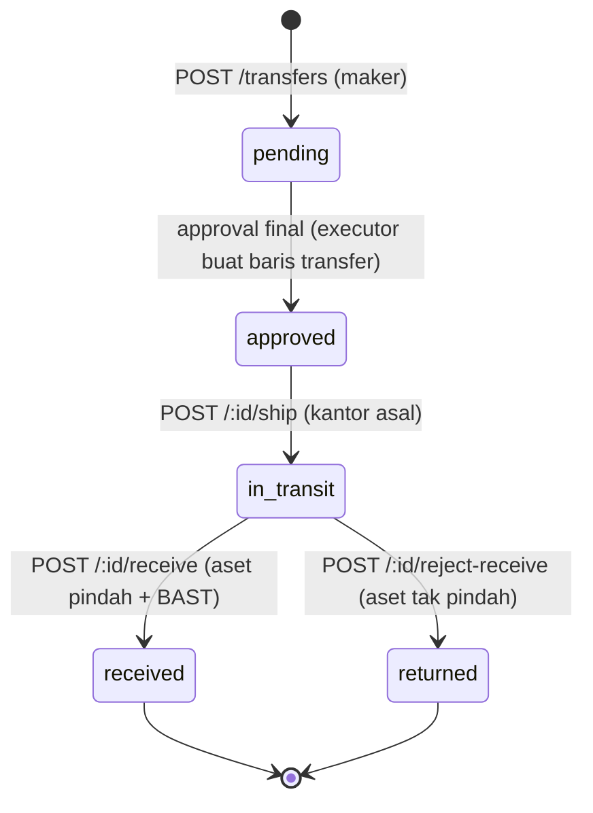

---

## 8. Penghapusan Aset (disposal)

**Izin**: `disposal.manage`, `disposal.view`.

### Endpoint

`GET /disposals`, `GET /disposals/:id`, `POST /disposals`, `POST /disposals/:id/document`
(lampir BAST multipart), `GET /assets/:id/disposal`.

### Validasi

`SubmitRequest`: `asset_id` `required,uuid`, `method`
`required,oneof=sale auction donation write_off`, `disposal_date` `required` (`YYYY-MM-DD`),
`proceeds`/`bast_no`/`reason` opsional. **`book_value_at_disposal` tidak diterima dari klien** -
dihitung server.

### Aturan bisnis

- Nilai buku dihitung server via `depr.BookValueAsOf` (PSAK 16 per bulan disposal). Nilai itu menjadi
  amount approval (menentukan tier) sekaligus `book_value_at_disposal`.
- `gain_loss = proceeds - book_value_at_disposal` dihitung di SQL (positif = untung, negatif = rugi).
- Guard: aset dalam scope, transisi ke `disposed` valid, tak ada disposal/permintaan disposal aktif.
- Alur lewat approval: `POST /disposals` hanya membuka request `asset_disposal`; baris disposal dibuat
  dan aset jadi `disposed` oleh executor saat approval final.

### Contoh data

```json
POST /api/v1/disposals
{ "asset_id": "3f1c2b90-...", "method": "sale", "disposal_date": "2026-07-21",
  "proceeds": "500000", "bast_no": "BAST-DSP-2026-07-001",
  "reason": "Printer rusak, tidak ekonomis diperbaiki" }
```

### Diagram

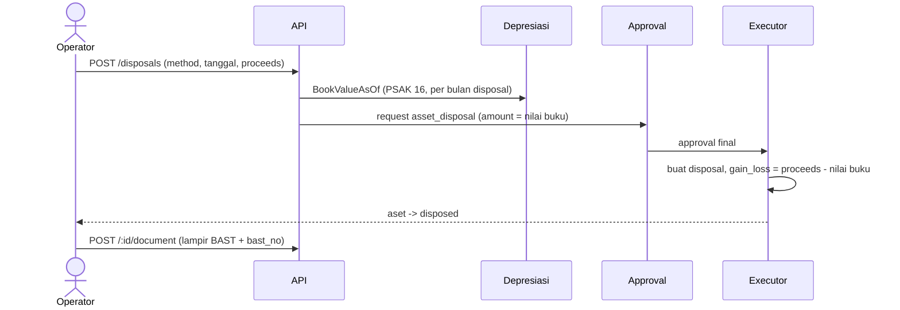

---

## 9. Stock Opname (stockopname)

**Izin**: `stockopname.manage`, `stockopname.view`.

> Untuk rincian "siapa membuat sesi, siapa mengisi, siapa reconcile/close, dan yang boleh/tidak boleh",
> lihat **Lampiran A bagian A.7** di akhir dokumen.

### Endpoint

`GET/POST /stock-opname/sessions`, `GET /stock-opname/sessions/:id`, `.../items`,
`POST .../start`, `.../scan`, `PATCH .../items/:itemId`, `POST .../reconcile`,
`POST .../items/:itemId/follow-up`, `POST .../close`, `GET .../report?format=pdf|xlsx`.

### Validasi

`CreateSessionRequest`: `office_id` `required,uuid`, `period` `required` (`YYYY-MM` atau `YYYY-MM-DD`),
`name` opsional. `ScanRequest`: `asset_tag` `required`.
`SetResultRequest`: `result` `required,oneof=found not_found damaged misplaced pending`, `note`
opsional. `FollowupRequest`: `to_office_id`/`to_room_id` `omitempty,uuid`, `reason` opsional.
`reconcile` tanpa body (transisi status murni).

### Aturan bisnis

- `shared.opname_session_status`: `open` -> `counting` -> `reconciling` -> `closed` (linear).
- `shared.opname_item_result`: `pending`, `found`, `not_found`, `damaged`, `misplaced`.
- Buat sesi memotret semua aset dalam-scope non-disposed jadi item. Scan/set-result hanya saat
  `counting`. Scan aset di luar snapshot menyisipkan item `expected=false`.
- **Tindak lanjut** memetakan varian ke request modul lain (memakai Submit masing-masing):
  `not_found` -> disposal `write_off`; `misplaced` -> transfer (butuh `to_office_id`);
  `damaged` -> maintenance korektif; `found`/`pending` -> `ErrInvalidState`.

### Contoh data

```json
POST /api/v1/stock-opname/sessions
{ "office_id": "8a7b6c5d-...", "name": "Stock Opname Kantor Cabang Jakarta Juli 2026",
  "period": "2026-07" }
```

### Alur pengguna

Buat sesi (snapshot) lalu `start` (`counting`) lalu hitung fisik (`scan` per tag / set hasil item) lalu
`reconcile` (`reconciling`) lalu `follow-up` per varian lalu `close` (`closed`) lalu unduh Berita Acara.

### Diagram

Status sesi:

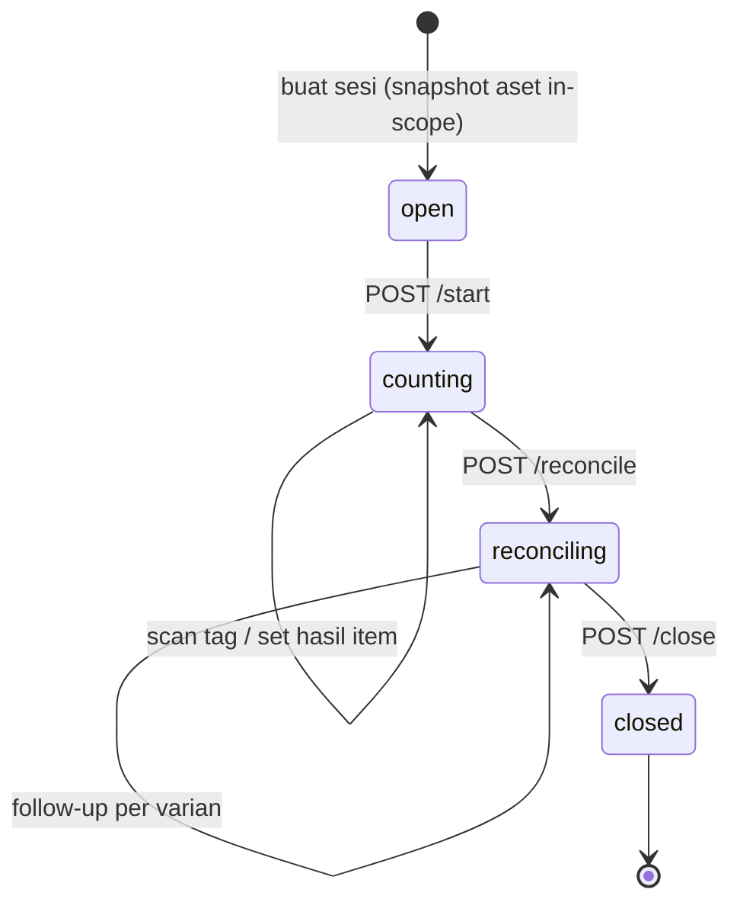

Pemetaan tindak lanjut varian:

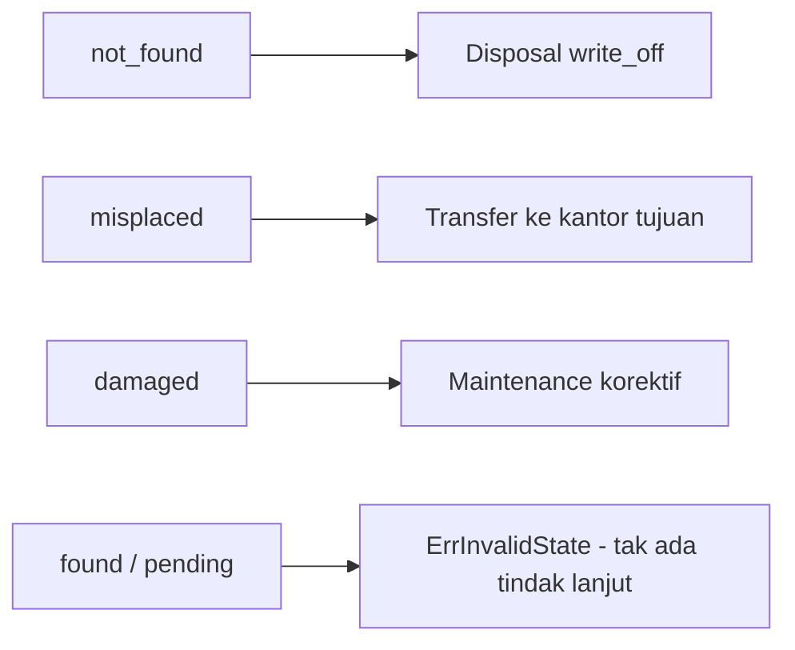

---

## 10. Maintenance

**Izin**: `maintenance.manage`, `maintenance.view`, `request.create` (laporan kerusakan Staf).

### Endpoint

Jadwal: `GET/POST /maintenance/schedules`, `PATCH/DELETE /maintenance/schedules/:id`.
Rekaman: `GET/POST /maintenance/records`, `GET/PATCH /maintenance/records/:id`.
`GET /maintenance/attention` (antrean perlu tindak lanjut), `POST /maintenance/reports` (laporan Staf,
multipart `photo`), `GET /assets/:id/maintenance`.

### Validasi

`CreateScheduleRequest`: `asset_id` `required,uuid`, `interval_months` `required,min=1`, `start_date`
`required`, `maintenance_category_id` `omitempty,uuid`.
`CreateRecordRequest`: `asset_id` `required,uuid`, `type` `required,oneof=preventive corrective`,
`description` `required`, `status` `omitempty,oneof=scheduled in_progress completed cancelled`,
`schedule_id`/`vendor_id`/`maintenance_category_id`/`problem_category_id` `omitempty,uuid`,
`cost`/`scheduled_date`/`completed_date` opsional.
`ReportForm` (multipart): `asset_id` `required,uuid`, `problem_category_id` `required,uuid`,
`description` opsional, file `photo`.

### Aturan bisnis

- `shared.maintenance_type`: `preventive`/`corrective`. `shared.maintenance_status`: `scheduled`,
  `in_progress`, `completed`, `cancelled` (dua terakhir terminal).
- Set `in_progress` mem-flip aset ke `under_maintenance` (aset sibuk `in_transfer` dll -> `ErrAssetBusy`).
  `completed` menyentuh jadwal (`last_done`/`next_due`) dan melepas aset ke `assigned`/`available`.
- **Tidak ada ambang approval berbasis biaya**; `cost` bebas. Hanya jalur **laporan kerusakan Staf**
  yang lewat approval (tipe `maintenance`, amount `"0"`, `request.create`), foto di-EXIF-strip, dijaga
  satu laporan pending per (aset, maker).

### Contoh data

```json
POST /api/v1/maintenance/records
{ "asset_id": "c1d2e3f4-...", "type": "corrective", "status": "completed",
  "completed_date": "2026-07-21", "cost": "750000",
  "description": "Servis AC ruang server: isi freon + bersihkan filter" }
```

### Diagram

Status rekaman maintenance (`validTransition`):

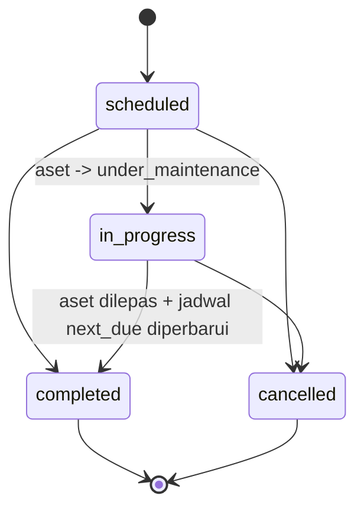

Jalur laporan kerusakan Staf (lewat approval):

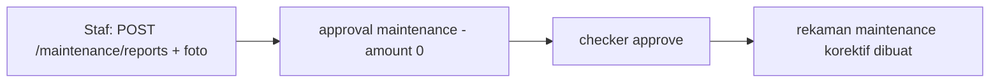

---

## 11. Penyusutan (depreciation) - dwibasis

**Izin**: `depreciation.manage`, `depreciation.view`, `asset.view`. **Tidak** ber-office-scope (tutup
buku global).

### Endpoint

`GET /depreciation/periods`, `POST /depreciation/periods/:period/compute|close` (`:period` = `YYYY-MM`),
`GET /depreciation/schedule`, `GET /depreciation/journal`, `GET /depreciation/journal/export`,
`GET /assets/:id/depreciation`, `POST /assets/:id/impairment` (PSAK 48).

### Validasi

Compute/close tanpa body (period di path). `ImpairmentRequest`: `recoverable_amount` `required`
(desimal non-negatif, divalidasi `parsePlainDecimal`), `reason` `required`. Param `basis` default
`commercial`; hanya `commercial`/`fiscal`.

### Aturan bisnis

- `shared.depreciation_method`: `straight_line`/`declining_balance`. `shared.depreciation_basis`:
  `commercial`/`fiscal`. Status periode: `open`/`computed`/`closed`.
- **Komersial (PSAK 16)**: metode/umur/nilai sisa dari override aset atau default kategori.
- **Fiskal (PMK 72/2023)**: umur dan tarif dari tabel normatif `FiscalRules`, **tanpa nilai sisa**;
  declining-balance tidak berlaku untuk bangunan (fallback ke garis lurus).

  | Kelompok | Umur (bln) | Garis lurus | Saldo menurun |
  |---|---|---|---|
  | kelompok_1 | 48 | 25% | 50% |
  | kelompok_2 | 96 | 12,5% | 25% |
  | kelompok_3 | 192 | 6,25% | 12,5% |
  | kelompok_4 | 240 | 5% | 10% |
  | bangunan_permanen | 240 | 5% | - |
  | bangunan_non_permanen | 120 | 10% | - |
  | non_susut | - | (dilewati) | - |

- Perhitungan bulanan (`math/big.Rat`, 2 desimal half-up). Garis lurus dihitung ulang tiap bulan dari
  saldo berjalan (perubahan estimasi/impairment bersifat prospektif); bulan terakhir menyerap sisa
  agar closing tepat di nilai sisa (komersial) / 0 (fiskal).
- `ComputePeriod` idempoten + advisory-lock, meregenerasi entri non-closed kedua basis dan menyegarkan
  `accumulated_depreciation`/`book_value` aset. `ClosePeriod` hanya dari `computed`, berurutan.
- **Jurnal**: satu debit per akun GL kategori ("Beban Penyusutan - {kategori}"), satu kredit ke akun
  akumulasi; balance by construction.
- **Impairment (PSAK 48)**: recoverable harus non-negatif dan **di bawah** book value kini; menulis
  turun book value, resume penyusutan dari lantai lebih rendah pada compute berikutnya.

### Contoh data

```
POST /api/v1/depreciation/periods/2026-07/compute      (tanpa body)
POST /api/v1/depreciation/periods/2026-07/close         (tanpa body)
```
```json
POST /api/v1/assets/{id}/impairment
{ "recoverable_amount": "9000000", "reason": "Uji penurunan nilai: harga pasar turun signifikan" }
```

### Diagram

Daur hidup periode tutup buku:

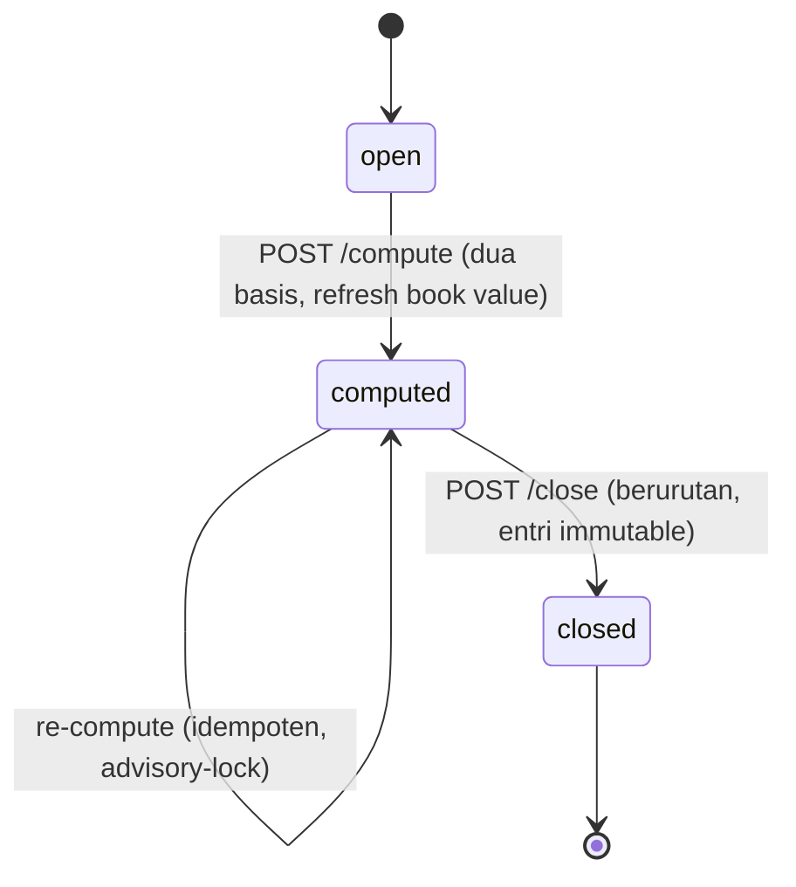

Alur bulanan:

```mermaid
flowchart LR
    A[GET /periods - bulan berjalan] --> B[POST /compute periode]
    B --> C[GET /schedule?basis=commercial|fiscal + KPI]
    B --> D[GET /journal - debit per GL kategori, kredit akumulasi]
    C --> E[POST /close]
    D --> E
    F[POST /assets/:id/impairment - PSAK 48] -. lantai baru .-> B
```

---

## 12. Laporan (report)

**Izin**: `report.view` (baca, dibagikan mobile), `report.export` (ekspor, **web-only**).

### Endpoint

`GET /dashboard/summary`, `GET /dashboard/export` (web-only), `GET /reports/:type`,
`GET /reports/:type/export` (web-only).

### Validasi (query, bukan body)

- `:type`: whitelist `assets|depreciation|utilization|maintenance|transfers|disposals|opname`.
- `period`: `last30|this_month|this_quarter|ytd`, atau `date_from`+`date_to` (`YYYY-MM-DD`, pasangan).
- `office_id`: UUID; **403** bila di luar scope (dicek sebelum service).
- `status` (laporan assets): harus enum `shared.asset_status`.
- `basis`: `commercial|fiscal`. `format` (ekspor): **`xlsx|pdf` saja** (tanpa CSV).
- `variant`: `table` (default) atau `gl_recap` (hanya untuk `disposals`, selain itu 422).

### Alur pengguna

Buka dashboard (`/dashboard/summary`, ter-cache) lalu pilih tipe + filter (`/reports/:type`, JSON
ber-cap) lalu tinjau tabel/chart/total lalu ekspor (`/reports/:type/export?format=xlsx|pdf`, sesi web).
Untuk disposal, `variant=gl_recap` menghasilkan rekap jurnal seimbang.

### Diagram

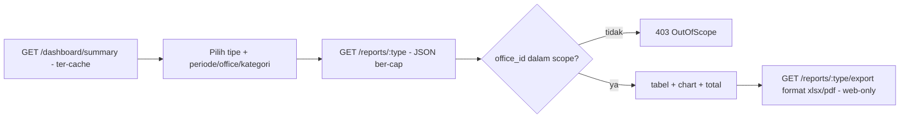

---

## 13. Impor Massal (importer)

**Izin**: per-target (`asset` -> `asset.manage`, `employee` -> `masterdata.employee.manage`,
`office` -> `masterdata.office.manage`, `reference:*` -> `masterdata.global.manage`). Seluruh grup
**web-only**.

### Endpoint

`GET /imports/template`, `POST /imports` (multipart), `GET /imports`, `GET /imports/:id`,
`GET /imports/:id/rows`, `POST /imports/:id/confirm|cancel`, `GET /imports/:id/error-report`.

### Validasi

`POST /imports` (multipart, bukan JSON): `file` wajib (ekstensi `.csv`/`.xlsx`, nama dibersihkan),
`target` wajib. Ukuran maks `ImportMaxBytes` (default 10 MiB, 413). Baris maks `ImportMaxRows`
(default 10000, `ErrTooManyRows`). File kosong -> `ErrEmptyFile`.
**Kontrak header kolom**: header dicocokkan case-insensitive dan tak peduli urutan, tetapi **setiap**
kolom `Columns()` target wajib ada di header (`ErrBadHeader`).

### Aturan bisnis

- Kepemilikan: setiap operasi job menegakkan `assertOwner` (403 bila bukan pembuat).
- Lifecycle: `pending` -> `processing` -> `validated` -> `confirmed` -> `executing` ->
  `completed`/`failed`. `confirm` hanya dari `validated`.
- Worker async (`SELECT ... FOR UPDATE SKIP LOCKED`) memvalidasi memakai scope nyata maker (fail-closed).
- **Maker-checker pada commit**: hanya target `asset` (`NeedsApproval`) yang membuka approval
  (`asset_import`, amount = jumlah kolom `harga`) alih-alih eksekusi langsung.

### Contoh data

```
POST /api/v1/imports   (multipart: file=aset.csv, target=asset)  -> 201 job "pending"
GET  /api/v1/imports/{id}                                        -> "validated", success/failed rows
POST /api/v1/imports/{id}/confirm                                -> target asset: buka approval
```

### Diagram

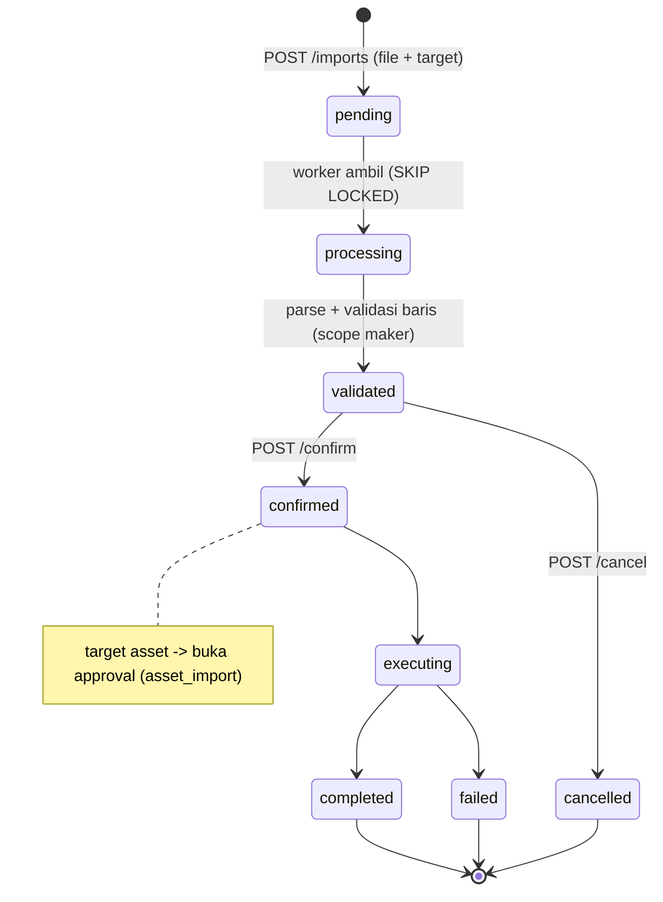

---

## 14. Audit Trail (audit)

**Izin**: `audit.view`. Read-only, office-scoped.

### Endpoint dan validasi

`GET /audit` dengan query: `search`, `limit`/`offset`, `actor_id` (UUID), `entity_type`,
`action` (`create|update|delete`), `from`/`to` (RFC3339). Tanpa body/binding.

### Aturan bisnis

- **Immutable**: hanya ada `InsertAuditLog` (tak ada update/delete). Penulisan `Record` best-effort
  (galat ditelan, tak pernah menggagalkan operasi pengguna).
- Diff menyimpan `{field: {before, after}}` (hanya yang berubah; `created_at`/`updated_at` diabaikan).
- Baca office-scoped, terbaru dulu, memuat actor + diff perubahan.

```
GET /api/v1/audit?action=update&entity_type=roles&from=2026-07-01T00:00:00Z&limit=20
```

### Diagram

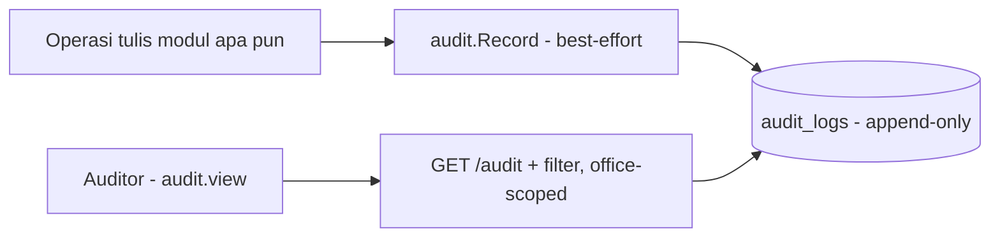

---

## 15. Notifikasi (notification)

**Izin**: tanpa kunci izin - kepemilikan (per-user) adalah keseluruhan model.

### Endpoint dan validasi

`GET /notifications` (`read` tri-state, `limit`/`offset`), `GET /notifications/unread-count`,
`POST /notifications/read-all`, `POST /notifications/:id/read` (`:id` UUID). Tanpa body.

### Aturan bisnis

- Setiap query mengikat `user_id`; notifikasi orang lain -> **404** (bukan 403, agar tak mengonfirmasi
  keberadaan).
- **Pipeline**: layanan bisnis menulis event ke `outbox` (dalam tx-nya) -> **Relay** ke Redis Stream ->
  **Consumer** (fan-out) menulis satu baris per penerima -> **Sweeper** mengumpan pengingat maintenance
  dan memangkas baris lama (retensi default 90 hari). At-least-once + dedup `ON CONFLICT DO NOTHING`.
- Tipe: `approval_decided`, `approval_pending`, `asset_returned`, `maintenance_due`. Param yang
  disimpan hanya param interpolasi i18n, bukan teks jadi.

### Alur pengguna

Muat `/unread-count` (badge) dan `/notifications?read=false` (feed); klik notifikasi -> `/:id/read`;
"tandai semua" -> `/read-all` (204).

### Diagram

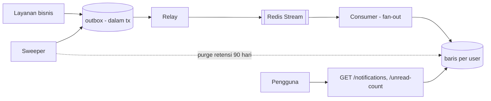

---

## 16. Administrasi Otorisasi / RBAC (authzadmin)

**Izin**: baca dilonggarkan (salah satu dari `role.manage`/`scope.manage`/`fieldperm.manage`, sebagian
plus `user.manage`); setiap mutasi ketat pada kunci spesifik. Seluruh grup **web-only**.

### Endpoint

`GET /authz/catalog`, `GET/POST /authz/roles`, `GET/PUT/DELETE /authz/roles/:id`,
`GET/PUT /authz/roles/:id/permissions` (`role.manage`),
`GET/PUT /authz/roles/:id/scope` (`scope.manage`),
`GET/PUT /authz/roles/:id/fields` (`fieldperm.manage`).

### Validasi (binding tag verbatim)

| DTO | Field | Aturan |
|---|---|---|
| roleCreateRequest | `code`, `name` | `required` |
| roleUpdateRequest | `name` | `required` (`code` kosong = pertahankan) |
| scopePolicyBody | `module`, `scope_level` | `required` |
| fieldPermBody | `entity`, `field` | `required` (`can_view`/`can_edit` bool) |
| permissionsRequest | `permissions` | (tanpa tag; divalidasi katalog) |

### Aturan bisnis

- **Invalidasi cache** pada setiap mutasi (`perm`/`scope`/`field`). Hapus role men-cascade soft-delete
  tiga tabel konfigurasi dan invalidasi ketiga cache.
- **Role sistem** (`is_system`): kode immutable, tak bisa dihapus (`ErrSystemRole` 409). Role terpakai
  (`CountUsersByRole>0`) tak bisa dihapus (`ErrRoleInUse` 409). Kode duplikat `ErrConflict` (409).
- **Semantik replace-set**: PUT permissions/scope/fields mengganti seluruh himpunan (sertakan semua
  yang ingin dipertahankan). Permission divalidasi katalog (`ErrUnknownPermission` 400);
  `scope_level` harus `global|office_subtree|office|own`.

### Contoh data

```json
POST /api/v1/authz/roles
{ "code": "staff_aset_cabang", "name": "Staff Aset Cabang", "description": "Kelola aset kantor cabang" }
```
```json
PUT /api/v1/authz/roles/{id}/permissions
{ "permissions": ["asset.view", "asset.manage"] }
```
```json
PUT /api/v1/authz/roles/{id}/scope
{ "policies": [ { "module": "assets", "scope_level": "office_subtree" },
                { "module": "*", "scope_level": "office" } ] }
```

### Alur pengguna

Buka admin RBAC (`/authz/catalog` + `/authz/roles`) lalu buat role lalu set permissions (replace-set,
tervalidasi katalog, invalidasi cache) lalu set scope per modul lalu set izin field. Assign user ke
role. Hapus hanya jika custom dan tak terpakai.

### Diagram

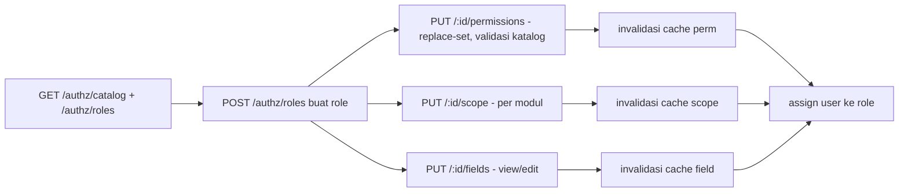

---

## Ringkasan enum penting

| Enum | Nilai |
|---|---|
| `asset_status` | available, assigned, under_maintenance, in_transfer, retired, disposed, lost |
| `request_type` | asset_create, asset_disposal, asset_transfer, assignment, maintenance, valuation_exclusion |
| `request_status` | pending, approved, rejected, cancelled |
| `transfer_status` | pending, approved, in_transit, received, rejected, cancelled, returned |
| `opname_session_status` | open, counting, reconciling, closed |
| `opname_item_result` | pending, found, not_found, damaged, misplaced |
| `disposal_method` | sale, auction, donation, write_off |
| `maintenance_type` | preventive, corrective |
| `maintenance_status` | scheduled, in_progress, completed, cancelled |
| `approver_level` | office, office_subtree, wilayah, pusat |
| `scope_level` | global, office_subtree, office, own |
| `depreciation_basis` | commercial, fiscal |
| `fiscal_asset_group` | kelompok_1..4, bangunan_permanen, bangunan_non_permanen, non_susut |

---

# Lampiran A: Skenario Approval dan Stock Opname (data realistis)

Lampiran ini menjabarkan **siapa boleh melakukan apa** pada alur persetujuan (semua modul yang lewat
maker-checker) dan pada stock opname, memakai contoh organisasi dan pelaku konkret. Semua aturan di sini
diambil dari kode: `eligibleToDecide` dan `resolveTierOffice` (`internal/approval/service.go`), band
ambang tersegel (migrasi `000016`, `000020`, `000026`, `000031`), serta gerbang izin dan scope opname
(`internal/stockopname/`).

## A.1 Contoh hierarki kantor

Tier kantor ditentukan dari `office_types.tier` (`pusat` / `wilayah` / `office`; cabang, unit, dan
outlet semuanya `office`).

```mermaid
flowchart TD
    KP["Kantor Pusat (tier: pusat) - KP"]
    KW["Kantor Wilayah III Jawa Barat (tier: wilayah) - KW-JABAR"]
    BDG["Kantor Cabang Bandung (tier: office) - KC-BDG"]
    BKS["Kantor Cabang Bekasi (tier: office) - KC-BKS"]
    KP --> KW
    KW --> BDG
    KW --> BKS
```

## A.2 Contoh pelaku (user), role, kantor, izin, dan scope

| Nama | Role | Kantor | Izin relevan | Data scope |
|---|---|---|---|---|
| Siti Nurhaliza | Staf | KC Bandung | `request.create`, `asset.view` | `own` (requests), `office` (assets) |
| Budi Santoso | Manager | KC Bandung | `request.create/decide`, `asset.manage`, `transfer/disposal/stockopname/assignment/maintenance.manage` | `office_subtree` (mencakup KC Bandung) |
| Dewi Lestari | Kepala Unit | KC Bandung | `request.create/decide`, `asset.manage`, `transfer/disposal/stockopname.manage` | `office_subtree` (mencakup KC Bandung) |
| Agus Prakoso | Kepala Kanwil | KW Jabar | `request.create/decide`, `asset.manage`, `transfer/disposal/stockopname.manage` | `office_subtree` (mencakup KW Jabar + semua cabang di bawahnya) |
| Hendra Gunawan | Pejabat Kantor Pusat (role custom, mis. "Kepala Divisi Umum") | Kantor Pusat | `request.create/decide`, `report.*`, dll. | `office_subtree` (berkantor di Kantor Pusat, mencakup Pusat + seluruh turunannya) |
| (akun sistem, bukan pegawai) | Superadmin | - | konfigurasi RBAC, kelola user, break-glass | `global` |

Catatan penting:

- **Staf hanya `request.create`** - tidak pernah bisa memutus approval, membuat sesi opname, atau
  mengisi opname.
- **Superadmin adalah akun sistem/teknis, bukan jabatan bisnis.** Sesuai prinsip tata kelola, role
  superadmin **sebaiknya tidak ditugaskan ke pegawai mana pun** - baik jabatan tertinggi (mis. direksi)
  maupun terendah - sehingga superadmin **dikecualikan dari seluruh alur validasi bisnis** (maker-checker,
  data scope, approval berjenjang) dan hanya dipakai untuk konfigurasi/pemulihan. Karena scope-nya
  `global`, superadmin secara teknis memenuhi tier mana pun; bila dipegang orang bisnis, ia bisa
  meruntuhkan pemisahan jenjang persetujuan. Karena itu approver puncak (tier `pusat`) diperankan oleh
  **pejabat Kantor Pusat** ber-role bisnis (Hendra), bukan superadmin.
- **Approver tier `pusat` memakai role custom.** Role bawaan tidak menyertakan pejabat Pusat; buat lewat
  modul RBAC (`authzadmin`): role dengan `request.decide` dan scope `office_subtree` untuk user yang
  berkantor di Kantor Pusat - subtree-nya otomatis mencakup kantor Pusat itu sendiri.
- Penyusutan (`depreciation.manage`) secara bawaan hanya melekat pada superadmin; untuk operasional,
  delegasikan ke role bisnis (mis. pejabat Pusat/akunting) alih-alih memakai akun superadmin.

## A.3 Aturan kelayakan approver (dari `eligibleToDecide`)

Seorang user boleh **memutus** sebuah langkah bila **keempat** syarat terpenuhi:

1. Punya izin `request.decide` (digerbang di route).
2. **Bukan** pengaju/maker request itu (SoD, ditegakkan ganda: CHECK DB `decided_by_id <> requested_by_id`
   plus service).
3. **Bukan** approver yang sudah memutus langkah sebelumnya pada rantai yang sama (tidak boleh approver
   berulang).
4. **Data scope-nya mencakup "kantor tier"** langkah itu.

Resolusi "kantor tier" (`resolveTierOffice`):

| `required_level` | Kantor tier yang dituju | Siapa yang scope-nya mencakup |
|---|---|---|
| `office` / `office_subtree` | **Kantor asal** request (kantor aset / batch) | Kepala Unit atau Manager kantor itu, Kepala Kanwil di atasnya, pejabat Pusat |
| `wilayah` | Leluhur terdekat ber-tier `wilayah` | Kepala Kanwil wilayah itu, pejabat Pusat |
| `pusat` | Leluhur terdekat ber-tier `pusat` | Pejabat Kantor Pusat (role bisnis `request.decide` + scope `office_subtree` berkantor di Pusat) |

Konsekuensi yang sering terlewat: pejabat yang lebih tinggi **boleh** memutus langkah yang lebih rendah
(scope-nya mencakup), tetapi begitu ia dipakai di satu langkah, ia **tidak boleh** dipakai lagi di
langkah berikutnya. Karena itu request 3 langkah (office + wilayah + pusat) **wajib** diputus oleh tiga
orang berbeda.

Superadmin sengaja **tidak dicantumkan** sebagai approver di tabel ini: meski scope `global`-nya secara
teknis mencakup semua tier, ia diperlakukan sebagai akun sistem dan dikecualikan dari peran approver
bisnis (lihat catatan A.2).

## A.4 Band ambang per tipe request (tersegel)

| Tipe request | Nilai (Rp) | Rantai langkah (level) |
|---|---|---|
| `asset_create` | 0 - 10 jt | office |
| | 10 jt - 100 jt | office, wilayah |
| | 100 jt ke atas | office, wilayah, pusat |
| `asset_import` | 0 - 10 jt | office |
| | 10 jt - 100 jt | office, wilayah |
| | 100 jt ke atas | office, wilayah, pusat |
| `asset_disposal` | 0 - 5 jt | office |
| | 5 jt - 50 jt | office, wilayah |
| | 50 jt ke atas | office, wilayah, pusat |
| `asset_transfer` | 0 - 50 jt | office |
| | 50 jt ke atas | office, wilayah |
| `assignment` (peminjaman) | berapa pun (amount 0) | office (satu langkah) |
| `valuation_exclusion` | berapa pun | wilayah (satu langkah) |

Nilai (`amount`) yang menentukan band: `asset_create` memakai `purchase_cost` (wajib sama dengan
`payload.purchase_cost`, anti-understatement); `asset_import` memakai jumlah kolom harga sebatch;
`asset_disposal` memakai **nilai buku** yang dihitung server; `asset_transfer` memakai `purchase_cost`;
`assignment` selalu `"0"`.

## A.5 Skenario per modul

### Skenario 1 - Pengadaan aset (asset_create) 18,5 juta di KC Bandung

Band 10-100 jt: **office lalu wilayah** (2 langkah).

```mermaid
sequenceDiagram
    actor Budi as Budi (Manager, KC Bandung) - MAKER
    participant API
    actor Dewi as Dewi (Kepala Unit, KC Bandung)
    actor Agus as Agus (Kepala Kanwil, KW Jabar)
    Budi->>API: POST /requests asset_create, amount 18.500.000
    Note over API: kantor asal = KC Bandung
    API-->>Budi: request pending (langkah 1: office, langkah 2: wilayah)
    Dewi->>API: approve langkah 1 (tier office = KC Bandung)
    Note over Dewi: Budi tak boleh - dia maker
    Agus->>API: approve langkah 2 (tier wilayah = KW Jabar)
    Note over Agus: Dewi tak bisa - scope-nya tak mencakup KW Jabar
    API->>API: executor bangkitkan tag KC-BDG-... + buat aset available
```

- **Boleh**: Dewi memutus langkah office; Agus (atau pejabat Pusat) memutus langkah wilayah.
- **Tidak boleh**: Budi memutus (maker); Dewi memutus langkah wilayah (scope tak mencakup KW Jabar);
  orang yang sama memutus dua langkah; Budi menurunkan `amount` di bawah `purchase_cost`.

### Skenario 2 - Penghapusan aset (asset_disposal) nilai buku 60 juta di KC Bandung

Band 50 jt ke atas: **office lalu wilayah lalu pusat** (3 langkah, 3 orang berbeda).

- Maker: Budi (`disposal.manage`) mengajukan `POST /disposals`. Server menghitung nilai buku (PSAK 16)
  = 60 jt, jadi `amount` request.
- Langkah 1 (office = KC Bandung): Dewi.
- Langkah 2 (wilayah = KW Jabar): Agus.
- Langkah 3 (pusat = Kantor Pusat): Hendra (Pejabat Kantor Pusat) - scope `office_subtree`-nya berkantor
  di Pusat sehingga mencakup kantor Pusat.
- **Tidak boleh**: Agus memutus langkah pusat (subtree Kanwil tidak naik ke Pusat); menghapus aset yang
  sudah punya disposal/permintaan disposal aktif; mengirim `book_value_at_disposal` dari klien
  (selalu dihitung server).

```mermaid
sequenceDiagram
    actor Budi as Budi (Manager, KC Bandung) - MAKER
    participant API
    actor Dewi as Dewi (Kepala Unit, KC Bandung)
    actor Agus as Agus (Kepala Kanwil, KW Jabar)
    actor Hendra as Hendra (Pejabat Kantor Pusat)
    Budi->>API: POST /disposals (nilai buku 60.000.000 dihitung server)
    API-->>Budi: pending - 3 langkah: office, wilayah, pusat
    Dewi->>API: approve langkah 1 (tier office = KC Bandung)
    Agus->>API: approve langkah 2 (tier wilayah = KW Jabar)
    Hendra->>API: approve langkah 3 (tier pusat = Kantor Pusat)
    Note over Budi: TIDAK boleh: maker memutus sendiri
    Note over Agus: TIDAK boleh langkah pusat - subtree Kanwil tak naik ke Pusat
    Note over Hendra: role bisnis di Pusat, bukan superadmin (akun sistem dikecualikan)
    API->>API: executor buat disposal (gain_loss) + aset disposed
```

### Skenario 3 - Mutasi aset (asset_transfer) 30 juta, KC Bandung ke KC Bekasi

Band 0-50 jt: **office** (1 langkah).

- Maker: Budi (`transfer.manage`) `POST /transfers` (kantor asal KC Bandung diturunkan dari aset).
- Approver langkah office: Dewi atau Agus (bukan Budi).
- Setelah `approved`: **kirim** `POST /:id/ship` oleh pihak KC Bandung (scope kantor asal); **terima**
  `POST /:id/receive` oleh Manager/Kepala Unit **KC Bekasi** (scope kantor tujuan) sambil mencatat BAST.
- **Tidak boleh**: menerima/mengirim oleh user yang scope-nya tak mencakup kantor asal/tujuan;
  mutasi ke kantor yang sama; mutasi aset yang sedang `in_transfer`.

```mermaid
sequenceDiagram
    actor Budi as Budi (Manager, KC Bandung) - MAKER
    participant API
    actor Dewi as Dewi (Kepala Unit, KC Bandung)
    actor MgrBks as Manager/Kepala Unit KC Bekasi
    Budi->>API: POST /transfers 30.000.000 (KC Bandung ke KC Bekasi)
    API-->>Budi: pending - 1 langkah office
    Dewi->>API: approve langkah office (Agus juga boleh, bukan Budi)
    API->>API: executor buat transfer approved
    Budi->>API: POST /:id/ship (scope kantor asal KC Bandung) -> in_transit
    MgrBks->>API: POST /:id/receive + BAST (scope kantor tujuan KC Bekasi) -> received
    Note over MgrBks: TIDAK boleh diterima user di luar scope KC Bekasi
```

### Skenario 4 - Peminjaman (assignment) oleh Staf

Satu langkah level office, `amount` 0.

- Maker: **Siti (Staf)** `POST /assignments/borrow` (butuh `request.create` + punya pegawai tertaut).
- Approver: Budi, Dewi, atau Agus (`request.decide`, scope mencakup KC Bandung) - bukan Siti.
- Eksekutor menautkan aset ke pegawai Siti dan set aset `assigned`.
- Jalur alternatif tanpa approval: **Budi (Manager)** `POST /assignments` (check-out langsung).
- **Tidak boleh**: Siti memutus permohonannya sendiri; Staf lain melihat/meminjamkan atas nama orang lain
  (`mine` diresolusi dari JWT).

```mermaid
sequenceDiagram
    actor Siti as Siti (Staf, KC Bandung) - MAKER
    participant API
    actor Dewi as Dewi (Kepala Unit, KC Bandung)
    Siti->>API: POST /assignments/borrow (amount 0)
    Note over Siti: butuh request.create + pegawai tertaut
    API-->>Siti: pending - 1 langkah office
    Dewi->>API: approve (Budi/Agus juga boleh, bukan Siti)
    API->>API: executor set aset assigned ke pegawai Siti
    Note over Siti: TIDAK boleh memutus permohonan sendiri (SoD)
    Note over API: alternatif - Manager POST /assignments = check-out langsung tanpa approval
```

### Skenario 5 - Maintenance

- Jalur normal (jadwal/rekaman) dilakukan **langsung** oleh pemegang `maintenance.manage` (Budi, Manager) -
  **tanpa** approval, tanpa ambang biaya.
- Jalur laporan kerusakan **Staf**: Siti `POST /maintenance/reports` (foto opsional) membuka approval
  tipe `maintenance` (`amount` 0, satu langkah office); setelah di-approve, rekaman korektif dibuat.

```mermaid
flowchart LR
    subgraph Langsung["Jalur normal - tanpa approval"]
      B[Budi - Manager, maintenance.manage] --> R[Buat jadwal/rekaman langsung, tanpa ambang biaya]
    end
    subgraph Lapor["Jalur laporan kerusakan Staf"]
      S[Siti - Staf, request.create] --> AP[approval maintenance amount 0, 1 langkah office]
      AP --> C[checker approve - bukan Siti]
      C --> M[rekaman korektif dibuat]
    end
```

### Skenario 6 - Impor massal aset (asset_import) 40 aset total 72 juta di KC Bandung

Impor melewati validasi worker lebih dulu, lalu commit membuka approval `asset_import` dengan `amount` =
jumlah kolom harga baris valid. Band mengikuti asset_create; total 72 jt masuk band 10-100 jt (office
lalu wilayah). Seluruh alur impor **web-only**.

```mermaid
sequenceDiagram
    actor Budi as Budi (Manager, KC Bandung) - MAKER
    participant API
    participant W as Worker impor
    actor Dewi as Dewi (Kepala Unit, KC Bandung)
    actor Agus as Agus (Kepala Kanwil, KW Jabar)
    Budi->>API: POST /imports (file 40 aset, target=asset)
    API->>W: job pending
    W->>W: validasi baris pakai scope maker -> validated
    Budi->>API: POST /imports/:id/confirm
    W->>API: buka approval asset_import, amount = jumlah harga = 72.000.000
    Note over API: band 10-100 jt = office lalu wilayah
    Dewi->>API: approve langkah office (KC Bandung)
    Agus->>API: approve langkah wilayah (KW Jabar)
    API->>W: executor buat baris aset (tag KC-BDG-...)
    Note over Budi: hanya pemilik job yang boleh confirm/cancel
```

- **Boleh**: Dewi memutus langkah office; Agus (atau pejabat Pusat) memutus langkah wilayah.
- **Tidak boleh**: Budi memutus (maker); user lain meng-confirm/cancel job milik Budi; header CSV tak
  memuat semua kolom target (`ErrBadHeader`); batch melebihi 10.000 baris atau 10 MiB.

### Skenario 7 - Pengecualian valuasi (valuation_exclusion) di KC Bandung

Mengeluarkan sebuah aset dari perhitungan penyusutan (set `excluded_from_valuation=true`). Selalu **satu
langkah level wilayah**, berapa pun nilainya.

```mermaid
sequenceDiagram
    actor Budi as Budi (Manager, KC Bandung) - MAKER
    participant API
    actor Agus as Agus (Kepala Kanwil, KW Jabar)
    actor Hendra as Hendra (Pejabat Kantor Pusat)
    Budi->>API: POST /requests valuation_exclusion (target_id = aset, alasan)
    API-->>Budi: pending - 1 langkah wilayah (tier = KW Jabar)
    Agus->>API: approve (Hendra/pejabat Pusat juga boleh)
    Note over Agus: Dewi/Kepala Unit KC Bandung tak bisa - scope tak mencakup KW Jabar
    API->>API: executor set excluded_from_valuation = true (aset keluar dari penyusutan)
```

- **Boleh**: Agus (Kepala Kanwil) atau pejabat Kantor Pusat (Hendra) memutus.
- **Tidak boleh**: Budi memutus (maker); Dewi/Manager tingkat cabang memutus (tier wilayah di luar
  scope-nya).

## A.6 Matriks izin ringkas (role bawaan)

| Kapabilitas | Staf | Manager | Kepala Unit | Kepala Kanwil | Superadmin |
|---|---|---|---|---|---|
| Ajukan request (`request.create`) | ya | ya | ya | ya | ya |
| Putuskan request (`request.decide`) | - | ya | ya | ya | ya |
| Kelola aset (`asset.manage`) | - | ya | ya | ya | ya |
| Mutasi (`transfer.manage`) | - | ya | ya | ya | ya |
| Penghapusan (`disposal.manage`) | - | ya | ya | ya | ya |
| Stock opname (`stockopname.manage`) | - | ya | ya | ya | ya |
| Penugasan langsung (`assignment.manage`) | - | ya | - | - | ya |
| Maintenance kelola (`maintenance.manage`) | - | ya | - | - | ya |
| Penyusutan (`depreciation.manage`) | - | - | - | - | ya |

Yang benar-benar bisa memutus sebuah langkah tetap dibatasi oleh **data scope terhadap kantor tier**
(bagian A.3), bukan sekadar memiliki `request.decide`.

Kolom **Superadmin** di atas menggambarkan kapabilitas teknis maksimum, bukan anjuran penugasan: sesuai
A.2, superadmin adalah akun sistem dan **tidak diberikan ke pegawai**, sehingga tidak muncul sebagai
pelaku pada skenario bisnis mana pun. Kebutuhan operasional tingkat Pusat diperankan role bisnis
(pejabat Kantor Pusat).

## A.7 Stock Opname - siapa boleh apa

Semua tulis opname digerbang `stockopname.manage`; semua baca `stockopname.view`. Setiap operasi juga
**scope-gated** terhadap kantor sesi. **Opname tidak menerapkan maker-checker internal** - tidak ada
pemisahan wajib antara pembuat sesi, pengisi, dan yang reconcile/close. Segregasi baru muncul saat
**tindak lanjut** (disposal/transfer/maintenance) yang masing-masing masuk approval sendiri.

| Operasi | Endpoint | Izin | Siapa (contoh) | Batasan |
|---|---|---|---|---|
| Buat sesi | `POST /stock-opname/sessions` | `stockopname.manage` | Budi/Dewi (KC Bandung), Agus (Kanwil) | Kantor sesi harus dalam scope; memotret semua aset in-scope non-disposed |
| Mulai (open ke counting) | `POST /:id/start` | `stockopname.manage` | sda | Hanya dari status `open` |
| Isi - pindai tag | `POST /:id/scan` | `stockopname.manage` | sda | Hanya saat `counting`; aset di luar scope ditolak (`ErrOutOfScope`) |
| Isi - set hasil item | `PATCH /:id/items/:itemId` | `stockopname.manage` | sda | Hanya saat `counting`; hasil `found/not_found/damaged/misplaced/pending` |
| Rekonsiliasi | `POST /:id/reconcile` | `stockopname.manage` | sda | Hanya `counting` ke `reconciling` |
| Tindak lanjut varian | `POST /:id/items/:itemId/follow-up` | `stockopname.manage` | sda | `not_found` ke disposal, `misplaced` ke transfer (butuh `to_office_id`), `damaged` ke maintenance; `found/pending` ditolak |
| Tutup | `POST /:id/close` | `stockopname.manage` | sda | Hanya `reconciling` ke `closed` |
| Lihat sesi/item/laporan | `GET .../items`, `.../report` | `stockopname.view` | keempat role di atas | Scope kantor sesi |

- **Siapa membuat sesi**: pemegang `stockopname.manage` yang scope-nya mencakup kantor itu -
  Manager/Kepala Unit kantor tersebut, Kepala Kanwil (untuk kantor mana pun di subtree-nya). Akun
  superadmin (sistem) tidak dipakai untuk operasi opname rutin.
- **Siapa mengisi opname** (scan/set hasil): siapa pun ber-`stockopname.manage` dalam scope kantor sesi -
  boleh orang yang sama dengan pembuat sesi, boleh berbeda. **Staf tidak bisa** (tak punya izin).
- **Siapa reconcile dan close**: sama - `stockopname.manage` dalam scope. Tidak ada syarat orang berbeda.
- **Contoh realistis**: Budi (Manager KC Bandung) membuat sesi "Stock Opname KC Bandung Juli 2026",
  memindai aset dan menandai hasil, lalu `reconcile`, membuat tindak lanjut (aset hilang jadi disposal
  `write_off` yang lalu diputus checker berbeda lewat approval), dan `close`. Agus (Kepala Kanwil) juga
  berwenang penuh atas sesi itu; Siti (Staf) tidak dapat mengakses tulis apa pun.

```mermaid
flowchart TD
    subgraph Opname["Stock opname - semua butuh stockopname.manage + scope kantor"]
      C[Budi buat sesi - snapshot aset KC Bandung] --> S[start counting]
      S --> F[scan / set hasil item]
      F --> R[reconcile]
      R --> FU{hasil varian}
    end
    FU -- not_found --> D[Disposal write_off -> approval disposal]
    FU -- misplaced --> T[Transfer -> approval transfer]
    FU -- damaged --> M[Maintenance korektif]
    R --> CL[close]
    Staf[Siti - Staf] -. tidak punya stockopname.manage .-> X[Ditolak 403]
```
