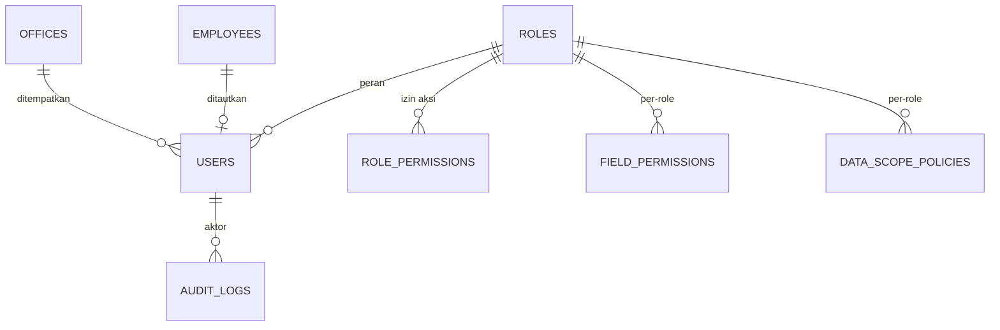
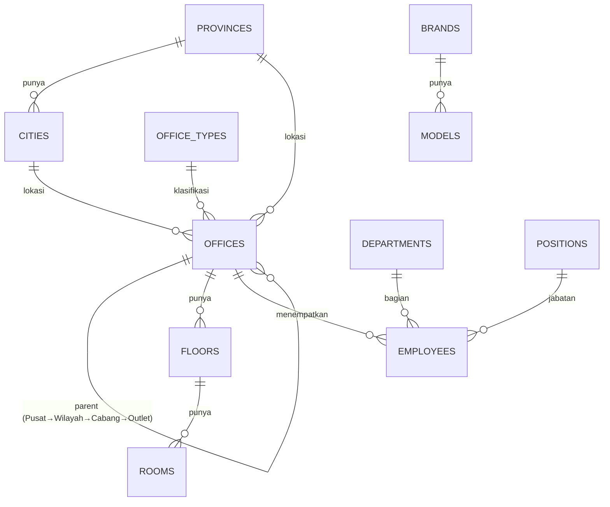
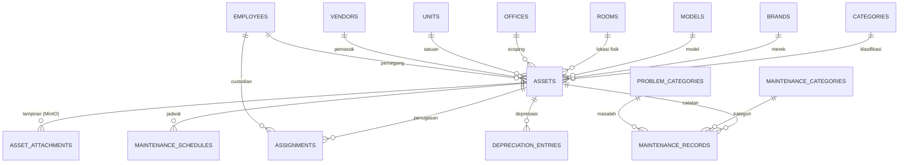
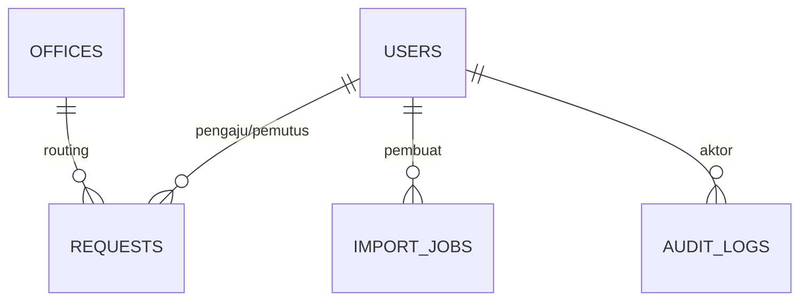

# Inventra — Desain Database

| | |
|---|---|
| **Produk** | Inventra (Asset Management System) |
| **Database** | PostgreSQL 16 |
| **Akses kode** | sqlc (type-safe) · migrasi golang-migrate |
| **Sumber kebenaran** | Dokumen ini menjabarkan [PRD.md §6](PRD.md) menjadi skema konkret |
| **Tanggal** | 2026-06-23 |

> Dokumen ini menjelaskan **seluruh database**: konvensi, tipe enum, relasi (ERD), dan
> kamus data (data dictionary) tiap tabel. Dibuat sebelum implementasi fitur agar skema,
> penamaan, dan integritas konsisten lintas modul.

---

## 1. Konvensi

| Aspek | Keputusan |
|---|---|
| **Primary key** | `id UUID PRIMARY KEY DEFAULT gen_random_uuid()` (pgcrypto, migrasi `000001_init`) |
| **Penamaan** | tabel `snake_case` jamak; kolom `snake_case`; FK `<entitas>_id` |
| **Timestamp (wajib)** | **Semua tabel** punya `created_at timestamptz NOT NULL DEFAULT now()` & `updated_at timestamptz NOT NULL DEFAULT now()` (di-update via trigger `set_updated_at()`). Pengecualian: tabel append-only `audit_logs` hanya `created_at`. |
| **Soft delete (semua tabel)** | Setiap tabel punya `deleted_at timestamptz NULL`. "Hapus" = set `deleted_at = now()` (+ catat di `audit_logs`); data tidak pernah dibuang fisik. Semua query default memfilter `WHERE deleted_at IS NULL`. |
| **Unique + soft delete** | Semua constraint UNIQUE memakai **partial index** `... WHERE deleted_at IS NULL` agar kode/email dapat dipakai ulang setelah baris dihapus. |
| **Jejak pengguna** | `created_by` (FK `users`) **hanya pada tabel operasional/transaksional** (assets, asset_attachments, assignments, maintenance_*, requests, import_jobs) — untuk scope `own` & tampilan. **`updated_by` tidak dipakai** (gunakan `audit_logs`). Master/referensi cukup `audit_logs`. |
| **Uang** | `numeric(18,2)` (mata uang default IDR) |
| **Rate/persen** | `numeric(5,4)` (mis. salvage rate 0.1000 = 10%) |
| **Periode depresiasi** | `date` pada hari-1 bulan (mis. `2026-06-01`) |
| **Enum vs tabel** | Himpunan **domain tetap** (status, dll) → ENUM PostgreSQL (§2). Himpunan yang **dapat dikonfigurasi superadmin** (peran) → **tabel** `roles` (§4.1), bukan enum. |
| **`is_active` ≠ `deleted_at`** | `is_active boolean DEFAULT true` = toggle bisnis (aktif/nonaktif, FR-7.5) pada master data; `deleted_at` = terhapus. Keduanya berbeda dan bisa hidup berdampingan. |
| **Scoping** | tabel beroperasi-aset menyimpan `office_id` (didenormalisasi) untuk filter subtree; "kepemilikan" via `employee_id`/`created_by`. |
| **URL & ID** | UUID v4 aman ditampilkan di URL (tak bisa di-enumerasi) — **tidak ada** kolom `label_id` terpisah. URL ramah-baca memakai kode manusiawi yang ada (`asset_tag`, `offices.code`, `employees.code`) sebagai slug. |
| **FK on delete** | Dengan soft delete, FK fisik umumnya `RESTRICT`/`NO ACTION`; "cascade soft delete" (mis. attachment ikut terhapus saat aset dihapus) ditangani di service layer. |

### 1.1 Refinement terhadap PRD §6
- **Peran = tabel, bukan enum.** `user_role` enum diganti tabel **`roles`** (lihat §4.1) karena superadmin dapat menambah/mengubah peran. RBAC per-aksi dibuat data-driven via `role_permissions`. Referensi `role` di `users`, `field_permissions`, `data_scope_policies` menjadi `role_id` (FK `roles`).
- `data_scope_policies.module` memakai sentinel **`'*'`** (NOT NULL, default `'*'`) untuk baris default per-role — agar `UNIQUE(role_id, module)` dapat ditegakkan (NULL di Postgres dianggap distinct).
- `assets.office_id` ditambahkan (diturunkan dari `room → floor → office`) untuk mempercepat filter scoping.
- `assets.asset_tag` **adalah kode aset unik** (mis. `AST-2026-0001`, FR-2.2) sekaligus payload **barcode** (FR-2.12) — bukan dua hal berbeda.
- Soft delete & `created_at`/`updated_at` diterapkan ke seluruh tabel (lihat §1).

---

## 2. Tipe Enum

> **Peran (role) BUKAN enum** — disimpan di tabel `roles` (§4.1) agar dapat dikonfigurasi superadmin.

```sql
CREATE TYPE user_status         AS ENUM ('active','inactive','suspended');
CREATE TYPE scope_level         AS ENUM ('global','office_subtree','office','own');
CREATE TYPE asset_status        AS ENUM ('available','assigned','under_maintenance','retired','lost');
CREATE TYPE depreciation_method AS ENUM ('straight_line','declining_balance');
CREATE TYPE assignment_status   AS ENUM ('active','returned');
CREATE TYPE maintenance_type    AS ENUM ('preventive','corrective');
CREATE TYPE maintenance_status  AS ENUM ('scheduled','in_progress','completed','cancelled');
CREATE TYPE request_type        AS ENUM ('asset_create','asset_delete','assignment','maintenance','valuation_exclusion');
CREATE TYPE request_status      AS ENUM ('pending','approved','rejected','cancelled');
CREATE TYPE attachment_kind     AS ENUM ('photo','document');
CREATE TYPE import_status       AS ENUM ('pending','processing','completed','failed');
CREATE TYPE audit_action        AS ENUM ('create','update','delete');
```

> `assignment.status = active` yang melewati `due_date` dianggap **overdue** (turunan, bukan kolom).

---

## 3. ERD (Relasi)

### 3.1 Identity & Otorisasi


### 3.2 Master Data & Struktur Kantor


### 3.3 Aset & Operasional


### 3.4 Approval, Audit & Import


---

## 4. Kamus Data (Data Dictionary)

Notasi: **PK** primary key · **FK** foreign key · `?` nullable.

> **Kolom implisit di SEMUA tabel** (tidak diulang di tiap baris, lihat §1): `created_at`, `updated_at`, `deleted_at` (soft delete). `audit_logs` hanya `created_at`. Semua `UNIQUE` adalah partial `WHERE deleted_at IS NULL`.

### 4.1 Identity & Otorisasi

#### `roles` — peran (dapat dikonfigurasi superadmin)
| Kolom | Tipe | Null | Default | Keterangan |
|---|---|---|---|---|
| id | uuid | no | gen_random_uuid() | **PK** |
| code | text | no | | **UNIQUE** — referensi stabil (mis. `superadmin`, `kepala_kanwil`, `kepala_unit`, `manager`, `staf`) |
| name | text | no | | nama tampil |
| description | text? | yes | | |
| is_system | boolean | no | false | `true` = peran bawaan; tak dapat dihapus & `code`-nya terkunci |

Index: partial `UNIQUE(code)`. Seed: 5 peran bawaan `is_system=true`. Superadmin dapat menambah peran kustom.

#### `role_permissions` — RBAC per-aksi (data-driven, menggantikan matriks hardcoded)
| Kolom | Tipe | Null | Keterangan |
|---|---|---|---|
| id | uuid | no | **PK** |
| role_id | uuid | no | **FK** roles |
| permission_key | text | no | kunci aksi, mis. `asset.create`, `asset.checkout`, `request.approve`, `user.manage`, `report.export` — katalog kunci di-seed dari matriks PRD §2.1 |

Index: partial `UNIQUE(role_id, permission_key)`, `idx_role_permissions_role`. Ditembolok di Redis.

#### `users`
| Kolom | Tipe | Null | Default | Keterangan |
|---|---|---|---|---|
| id | uuid | no | gen_random_uuid() | **PK** |
| employee_id | uuid? | yes | | **FK** employees — pegawai tertaut |
| office_id | uuid? | yes | | **FK** offices — kantor penempatan / jangkar scoping (NULL = global, untuk superadmin) |
| name | text | no | | nama tampil |
| email | citext | no | | **UNIQUE** (partial) |
| password_hash | text? | yes | | NULL bila login hanya via Google |
| google_id | text? | yes | | **UNIQUE** (partial) — subject Google OAuth |
| avatar_url | text? | yes | | |
| role_id | uuid | no | | **FK** roles (default = peran `staf`) |
| status | user_status | no | 'active' | |

Index: partial `UNIQUE(email)`, partial `UNIQUE(google_id)`, `idx_users_office_id`, `idx_users_role_id`, `idx_users_employee_id`.

#### `field_permissions` — hak akses per-field per-role (§2.3 PRD, **semua entitas**)
| Kolom | Tipe | Null | Default | Keterangan |
|---|---|---|---|---|
| id | uuid | no | gen_random_uuid() | **PK** |
| entity | text | no | | nama entitas (mis. `assets`) |
| field | text | no | | nama field |
| role_id | uuid | no | | **FK** roles |
| can_view | boolean | no | true | |
| can_edit | boolean | no | false | |

Index: partial `UNIQUE(entity, field, role_id)`, `idx_field_permissions_role`. Ditembolok di Redis; invalidasi saat berubah.

#### `data_scope_policies` — lingkup data per-role (+ override per-modul) (§2.2 PRD)
| Kolom | Tipe | Null | Default | Keterangan |
|---|---|---|---|---|
| id | uuid | no | gen_random_uuid() | **PK** |
| role_id | uuid | no | | **FK** roles |
| module | text | no | '*' | `'*'` = default semua modul; mis. `assets`, `requests` = override |
| scope_level | scope_level | no | | global / office_subtree / office / own |

Index: partial `UNIQUE(role_id, module)`, `idx_data_scope_role`.

### 4.2 Master Data — Referensi & Geografi

#### `provinces`
| Kolom | Tipe | Null | Keterangan |
|---|---|---|---|
| id | uuid | no | **PK** |
| name | text | no | |
| code | text? | yes | **UNIQUE** (kode BPS opsional) |
| created_at / updated_at | timestamptz | no | |

#### `cities`
| id | uuid | no | **PK** |
| province_id | uuid | no | **FK** provinces |
| name | text | no | |
| code | text? | yes | **UNIQUE** |
| ts | timestamptz | no | created/updated |

#### `office_types`
| id | uuid PK · name text UNIQUE (Pusat/Wilayah/Cabang/Outlet) · is_active bool · ts |

#### `departments`
| id | uuid PK · name text · code text? UNIQUE · is_active bool · ts |

#### `positions`
| id | uuid PK · name text · is_active bool · ts |

#### `vendors`
| id uuid PK · name text · contact_name text? · phone text? · email text? · address text? · is_active bool · ts |

#### `brands`
| id uuid PK · name text UNIQUE · is_active bool · ts |

#### `models`
| id uuid PK · brand_id uuid **FK** brands · name text · is_active bool · ts · **UNIQUE(brand_id, name)** |

#### `categories` — kategori aset
| Kolom | Tipe | Null | Keterangan |
|---|---|---|---|
| id | uuid | no | **PK** |
| name | text | no | |
| code | text? | yes | **UNIQUE** |
| parent_id | uuid? | yes | **FK** categories (hierarki) |
| default_depreciation_method | depreciation_method? | yes | nilai default untuk aset |
| default_useful_life_months | int? | yes | |
| default_salvage_rate | numeric(5,4)? | yes | |
| is_active | boolean | no | |
| ts | timestamptz | no | |

#### `maintenance_categories`
| id uuid PK · name text UNIQUE · is_active bool · ts | (mis. Servis Rutin, Kalibrasi) |

#### `problem_categories`
| id uuid PK · name text UNIQUE · is_active bool · ts | (mis. Hardware, Listrik, Fisik) |

#### `units` — satuan
| id uuid PK · name text · symbol text? · is_active bool · ts | (mis. Unit/Pcs/Set) |

### 4.3 Master Data — Struktur Kantor & Orang

#### `offices` — hierarki Pusat → Wilayah → Cabang → Outlet
| Kolom | Tipe | Null | Keterangan |
|---|---|---|---|
| id | uuid | no | **PK** |
| parent_id | uuid? | yes | **FK** offices (self) — NULL = akar (Pusat) |
| office_type_id | uuid | no | **FK** office_types |
| province_id | uuid? | yes | **FK** provinces |
| city_id | uuid? | yes | **FK** cities |
| name | text | no | |
| code | text | no | **UNIQUE** |
| address | text? | yes | |
| is_active | boolean | no | |
| ts | timestamptz | no | |

Index: `idx_offices_parent_id`, `UNIQUE(code)`. Lihat §5 untuk komputasi subtree.

#### `floors`
| id uuid PK · office_id uuid **FK** offices · name text · level int? · ts · **UNIQUE(office_id, name)** |

#### `rooms`
| id uuid PK · floor_id uuid **FK** floors · name text · code text? · ts · **UNIQUE(floor_id, name)** |

#### `employees` — data pegawai (custodian aset)

**Apa & kenapa terpisah dari `users`.** `employees` adalah **master data orang** dalam organisasi — daftar pegawai yang dapat **memegang/bertanggung jawab atas aset** (custodian). Ini sengaja **dipisahkan dari `users`** (akun login) karena:
- **Tidak semua pegawai punya akun aplikasi.** Aset bisa ditugaskan ke pegawai yang tidak pernah login (mis. petugas lapangan). Memaksa setiap custodian punya akun akan kotor & tidak realistis.
- **Pemisahan kepedulian.** `users` mengurus *autentikasi & otorisasi* (peran, scoping); `employees` mengurus *identitas kepegawaian* (NIP, departemen, jabatan, penempatan). Satu pegawai bisa berhenti login tetapi tetap tercatat sebagai pemegang aset historis.
- **Penautan opsional.** Satu `user` boleh ditautkan ke satu `employee` via `users.employee_id`. Saat tertaut, "data milik saya" (scope `own`) dipetakan ke aset yang dipegang `employee` tersebut.

**Peran dalam relasi:** menjadi target `assignments.employee_id` dan `assets.current_holder_employee_id` (pemegang aktif).

| Kolom | Tipe | Null | Keterangan |
|---|---|---|---|
| id | uuid | no | **PK** |
| code | text | no | **UNIQUE** (partial) — NIP/kode pegawai; dapat dipakai sebagai slug URL |
| name | text | no | nama lengkap |
| email | text? | yes | email kantor (informasional; bukan kredensial login) |
| department_id | uuid? | yes | **FK** departments |
| position_id | uuid? | yes | **FK** positions — jabatan |
| office_id | uuid | no | **FK** offices — kantor penempatan |
| status | user_status | no | active/inactive (mis. pegawai nonaktif/pensiun) |

Index: partial `UNIQUE(code)`, `idx_employees_office_id`, `idx_employees_department_id`, `idx_employees_position_id`.

### 4.4 Aset & Operasional

#### `assets`
| Kolom | Tipe | Null | Default | Keterangan |
|---|---|---|---|---|
| id | uuid | no | gen_random_uuid() | **PK** |
| asset_tag | text | no | | **UNIQUE** (partial) — **kode aset** unik (mis. `AST-2026-0001`, FR-2.2) = payload **barcode** Code128 (FR-2.12); dipakai sebagai slug URL |
| name | text | no | | |
| category_id | uuid | no | | **FK** categories |
| brand_id | uuid? | yes | | **FK** brands |
| model_id | uuid? | yes | | **FK** models |
| room_id | uuid | no | | **FK** rooms — lokasi fisik |
| office_id | uuid | no | | **FK** offices — diturunkan dari room, untuk scoping |
| unit_id | uuid? | yes | | **FK** units |
| status | asset_status | no | 'available' | state machine PRD §5 |
| serial_number | text? | yes | | |
| purchase_date | date? | yes | | |
| purchase_cost | numeric(18,2)? | yes | | harga perolehan |
| vendor_id | uuid? | yes | | **FK** vendors |
| warranty_expiry | date? | yes | | |
| specifications | jsonb | no | '{}' | atribut fleksibel |
| depreciation_method | depreciation_method? | yes | | override default kategori |
| useful_life_months | int? | yes | | |
| salvage_value | numeric(18,2)? | yes | | nilai sisa |
| current_holder_employee_id | uuid? | yes | | **FK** employees — pemegang aktif |
| excluded_from_valuation | boolean | no | false | hasil approval (§3.6) |
| valuation_exclusion_reason | text? | yes | | |
| created_by_id | uuid? | yes | | **FK** users |
| notes | text? | yes | | |
| ts | timestamptz | no | now() | created/updated |

Index: `UNIQUE(asset_tag)`, `idx_assets_office_id`, `idx_assets_status`, `idx_assets_category_id`, `idx_assets_holder`.

#### `asset_attachments` — file di MinIO
| id uuid PK · asset_id uuid **FK** assets `ON DELETE CASCADE` · kind attachment_kind · object_key text · thumbnail_key text? · original_filename text · size_bytes bigint · mime_type text · created_by_id uuid? **FK** users · created_at timestamptz |

Index: `idx_attachments_asset_id`.

#### `assignments` — check-out / check-in
| Kolom | Tipe | Null | Keterangan |
|---|---|---|---|
| id | uuid | no | **PK** |
| asset_id | uuid | no | **FK** assets |
| employee_id | uuid | no | **FK** employees (custodian) |
| assigned_by_id | uuid | no | **FK** users |
| checkout_date | timestamptz | no | |
| due_date | date? | yes | jatuh tempo |
| checkin_date | timestamptz? | yes | NULL = masih dipegang |
| condition_out | text? | yes | kondisi keluar |
| condition_in | text? | yes | kondisi masuk |
| status | assignment_status | no | active/returned |
| notes | text? | yes | |
| ts | timestamptz | no | |

Index: `idx_assignments_asset_id`, `idx_assignments_employee_id`, `idx_assignments_status`. Aturan: hanya **satu** assignment `active` per aset (partial unique index `WHERE status='active'`).

#### `maintenance_schedules`
| id uuid PK · asset_id uuid **FK** assets · maintenance_category_id uuid? **FK** · interval_months int · last_done_date date? · next_due_date date · is_active bool · ts |

Index: `idx_msched_next_due` (reminder).

#### `maintenance_records`
| Kolom | Tipe | Null | Keterangan |
|---|---|---|---|
| id | uuid | no | **PK** |
| asset_id | uuid | no | **FK** assets |
| maintenance_category_id | uuid? | yes | **FK** maintenance_categories |
| problem_category_id | uuid? | yes | **FK** problem_categories (laporan kerusakan) |
| type | maintenance_type | no | preventive/corrective |
| status | maintenance_status | no | default 'scheduled' |
| scheduled_date | date? | yes | |
| completed_date | date? | yes | |
| cost | numeric(18,2)? | yes | |
| vendor_id | uuid? | yes | **FK** vendors |
| performed_by | text? | yes | teknisi |
| description | text | no | |
| reported_by_id | uuid? | yes | **FK** users (pelapor) |
| ts | timestamptz | no | |

Index: `idx_mrec_asset_status`.

#### `depreciation_entries` (read model)
| id uuid PK · asset_id uuid **FK** assets · period date · opening_value numeric(18,2) · depreciation_amount numeric(18,2) · closing_value numeric(18,2) · method depreciation_method · created_at · **UNIQUE(asset_id, period)** |

Index: `idx_depr_asset_period`.

### 4.5 Approval, Audit & Import

#### `requests` — maker-checker generik (§3.6 PRD)
| Kolom | Tipe | Null | Keterangan |
|---|---|---|---|
| id | uuid | no | **PK** |
| type | request_type | no | asset_create / asset_delete / assignment / maintenance / valuation_exclusion |
| office_id | uuid? | yes | **FK** offices — routing approver berjenjang |
| target_entity | text? | yes | entitas terkait (mis. `assets`) |
| target_id | uuid? | yes | ID objek eksisting (untuk delete/exclusion) |
| payload | jsonb | no | data usulan |
| reason | text? | yes | |
| status | request_status | no | default 'pending' |
| requested_by_id | uuid | no | **FK** users (maker) |
| decided_by_id | uuid? | yes | **FK** users (checker) |
| decision_note | text? | yes | |
| decided_at | timestamptz? | yes | |
| ts | timestamptz | no | created/updated |

Index: `idx_requests_status_type`, `idx_requests_office_id`, `idx_requests_requester`. Aturan: `requested_by_id <> decided_by_id` (segregation of duty, §FR-6.4).

#### `audit_logs` — jejak seluruh tabel (§5.7 PRD)
| id uuid PK · actor_id uuid? **FK** users · entity_type text · entity_id uuid · action audit_action · changes jsonb (diff before/after) · ip text? · created_at timestamptz |

Index: `idx_audit_entity (entity_type, entity_id)`, `idx_audit_actor`, `idx_audit_created_at`. Diisi terpusat (decorator service/repository), bukan per-handler.

#### `import_jobs` — import massal CSV/XLSX (FR-2.11 / FR-7.5b)
| id uuid PK · target text (asset/employee/office/…) · format text (csv/xlsx) · filename text · object_key text? (sumber di MinIO) · status import_status · total_rows int · success_rows int · failed_rows int · error_report_key text? (laporan error di MinIO) · created_by_id uuid **FK** users · created_at · finished_at timestamptz? |

Index: `idx_import_created_by`, `idx_import_status`.

### 4.6 Ringkasan Index & Integritas

**Aturan umum (berlaku ke semua tabel):**
- **Setiap kolom FK diberi index** (PostgreSQL tidak membuatnya otomatis) — mempercepat join & cek `ON DELETE`.
- **Setiap UNIQUE adalah partial** `... WHERE deleted_at IS NULL`.
- **Index parsial soft-delete** untuk tabel yang sering di-list: `idx_<tabel>_active ON <tabel>(...) WHERE deleted_at IS NULL`.
- Kolom yang sering jadi **filter** (status, office_id, tanggal jatuh tempo) diberi index tersendiri.

**Daftar index per tabel (lengkap):**

| Tabel | Index |
|---|---|
| roles | `UNIQUE(code)` |
| role_permissions | `UNIQUE(role_id, permission_key)`, `idx_role_permissions_role` |
| users | `UNIQUE(email)`, `UNIQUE(google_id)`, `idx_users_office_id`, `idx_users_role_id`, `idx_users_employee_id` |
| field_permissions | `UNIQUE(entity, field, role_id)`, `idx_field_permissions_role` |
| data_scope_policies | `UNIQUE(role_id, module)`, `idx_data_scope_role` |
| provinces | `UNIQUE(code)` |
| cities | `UNIQUE(code)`, `idx_cities_province_id` |
| office_types · departments · positions · units | `UNIQUE(name/code)` |
| vendors | `idx_vendors_name` |
| brands | `UNIQUE(name)` |
| models | `UNIQUE(brand_id, name)`, `idx_models_brand_id` |
| categories | `UNIQUE(code)`, `idx_categories_parent_id` |
| maintenance_categories · problem_categories | `UNIQUE(name)` |
| offices | `UNIQUE(code)`, `idx_offices_parent_id`, `idx_offices_type_id`, `idx_offices_province_id`, `idx_offices_city_id` |
| floors | `UNIQUE(office_id, name)`, `idx_floors_office_id` |
| rooms | `UNIQUE(floor_id, name)`, `idx_rooms_floor_id` |
| employees | `UNIQUE(code)`, `idx_employees_office_id`, `idx_employees_department_id`, `idx_employees_position_id` |
| assets | `UNIQUE(asset_tag)`, `idx_assets_office_id`, `idx_assets_status`, `idx_assets_category_id`, `idx_assets_room_id`, `idx_assets_brand_id`, `idx_assets_model_id`, `idx_assets_vendor_id`, `idx_assets_unit_id`, `idx_assets_holder`, `idx_assets_created_by` |
| asset_attachments | `idx_attachments_asset_id`, `idx_attachments_created_by` |
| assignments | `idx_assignments_asset_id`, `idx_assignments_employee_id`, `idx_assignments_status`, `idx_assignments_assigned_by`, partial `UNIQUE(asset_id) WHERE status='active' AND deleted_at IS NULL` |
| maintenance_schedules | `idx_msched_asset_id`, `idx_msched_category_id`, `idx_msched_next_due` |
| maintenance_records | `idx_mrec_asset_id`, `idx_mrec_status`, `idx_mrec_category_id`, `idx_mrec_problem_id`, `idx_mrec_vendor_id`, `idx_mrec_reported_by` |
| depreciation_entries | `UNIQUE(asset_id, period)`, `idx_depr_asset_period` |
| requests | `idx_requests_status_type`, `idx_requests_office_id`, `idx_requests_requester`, `idx_requests_decided_by`, `idx_requests_target` |
| audit_logs | `idx_audit_entity(entity_type, entity_id)`, `idx_audit_actor`, `idx_audit_created_at` |
| import_jobs | `idx_import_created_by`, `idx_import_status` |

---

## 5. Scoping Hierarki Kantor

Lingkup `office_subtree` membutuhkan daftar **descendant** dari `office_id` user. Pendekatan:

```sql
WITH RECURSIVE subtree AS (
  SELECT id FROM offices WHERE id = $1
  UNION ALL
  SELECT o.id FROM offices o JOIN subtree s ON o.parent_id = s.id
)
SELECT id FROM subtree;
```

- Hasil (`descendant_ids`) **ditembolok di Redis** per `office_id` (mahal dihitung); invalidasi saat hierarki kantor berubah.
- Penegakan filter di service layer sesuai `scope_level` efektif (`data_scope_policies`):
  `global` → tanpa filter · `office_subtree` → `office_id IN (descendant_ids)` · `office` → `office_id = user.office_id` · `own` → `created_by/holder = user`.
- Alternatif performa (opsional, bila pohon sangat besar): kolom **materialized path** atau ekstensi **`ltree`**. Default: recursive CTE + cache.

---

## 6. Pemetaan ke Migrasi & Roadmap

Tiap fase roadmap (PRD §10) menambah migrasi `golang-migrate` di `backend/db/migrations`:

| Migrasi | Fase | Objek |
|---|---|---|
| `000001_init` | 1 | extension `pgcrypto` (sudah ada) |
| `0000xx_enums` | 2 | semua tipe enum (§2) + fungsi/trigger `set_updated_at` |
| `0000xx_identity` | 2 | `roles`, `role_permissions`, `users`, `field_permissions`, `data_scope_policies` |
| `0000xx_masterdata` | 3 | provinces, cities, office_types, departments, positions, vendors, brands, models, categories, maintenance_categories, problem_categories, units |
| `0000xx_offices` | 3 | offices, floors, rooms, employees |
| `0000xx_assets` | 4 | assets, asset_attachments |
| `0000xx_approval` | 5 | requests |
| `0000xx_assignment` | 6 | assignments |
| `0000xx_maintenance` | 7 | maintenance_schedules, maintenance_records |
| `0000xx_depreciation` | 8 | depreciation_entries |
| `0000xx_audit_import` | 2/4 | audit_logs (awal), import_jobs |

> `audit_logs` dibuat lebih awal (fase 2) karena bersifat cross-cutting.

---

## 7. Catatan & Keputusan Terbuka

**Keputusan yang sudah final (sesi ini):**
- **Soft delete menyeluruh** — semua tabel punya `deleted_at`; tak ada hard-delete (§1).
- **Peran = tabel `roles`** (configurable superadmin), bukan enum; RBAC per-aksi via `role_permissions` (§4.1).
- **`created_at`/`updated_at` wajib** di semua tabel; `created_by` hanya pada tabel operasional; `updated_by` tidak dipakai.
- **Tanpa `label_id`** — UUID dipakai langsung di URL; slug ramah-baca via kode manusiawi.
- **`asset_tag` = kode aset = barcode** (satu hal yang sama).

**Masih terbuka (ada default):**
- **DB-Q1** — `email` memakai tipe `citext` (case-insensitive, perlu extension `citext`); alternatif: lowercase + `text`. (sementara: `citext`).
- **DB-Q3** — Retensi `audit_logs` & `import_jobs` (volume besar): perlu kebijakan arsip/partisi? (sementara: tanpa partisi; ditinjau saat volume tumbuh).
- **DB-Q4** — `created_by` saya batasi ke tabel operasional (bukan semua tabel). Setuju, atau Anda ingin `created_by`+`updated_by` di **semua** tabel demi keseragaman?
