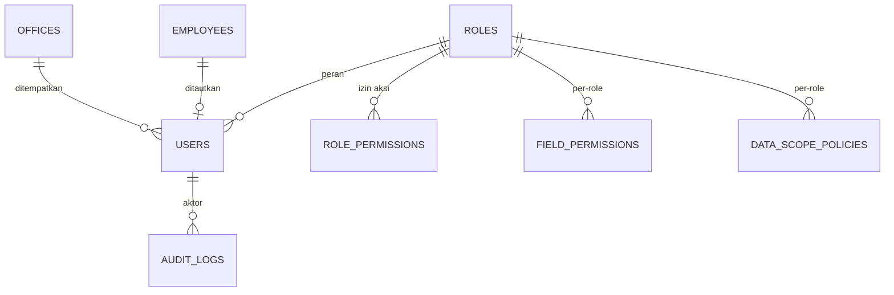
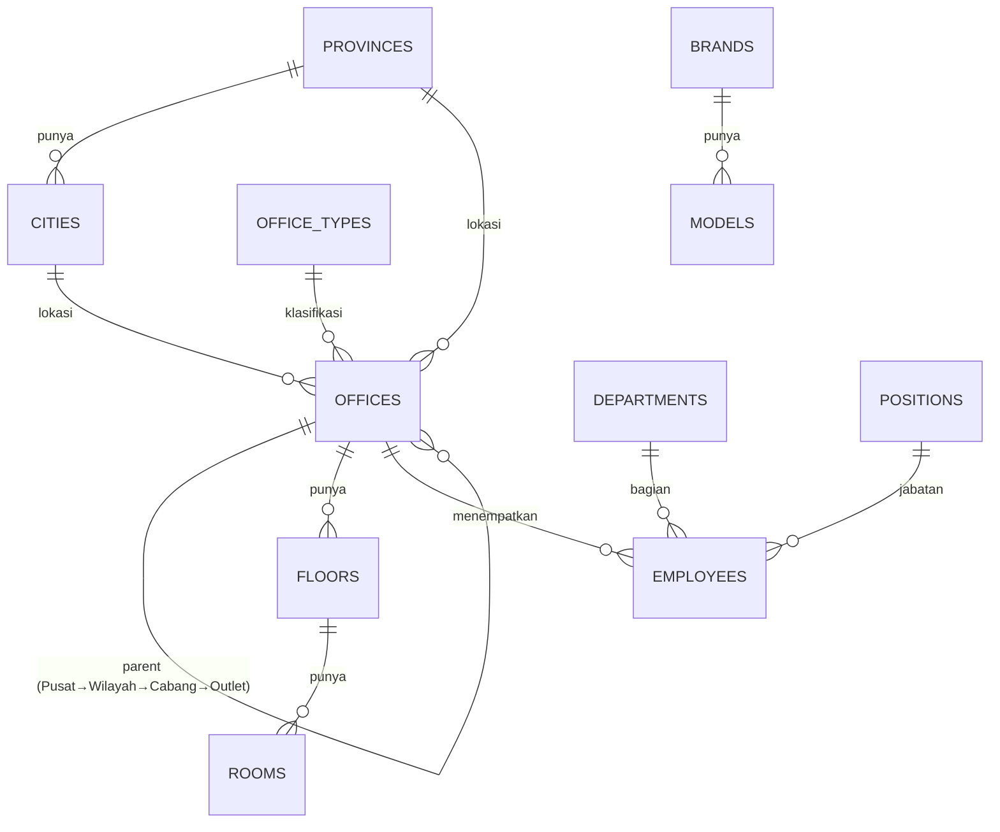
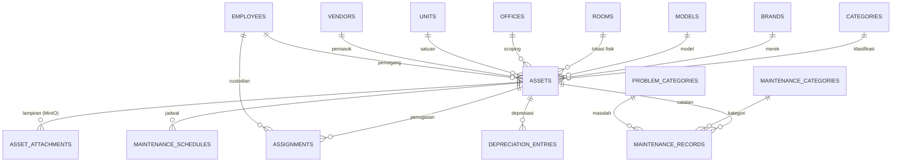
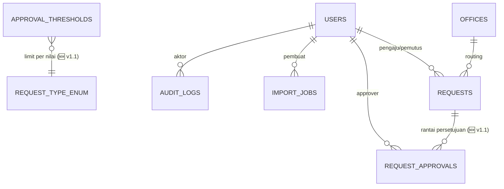
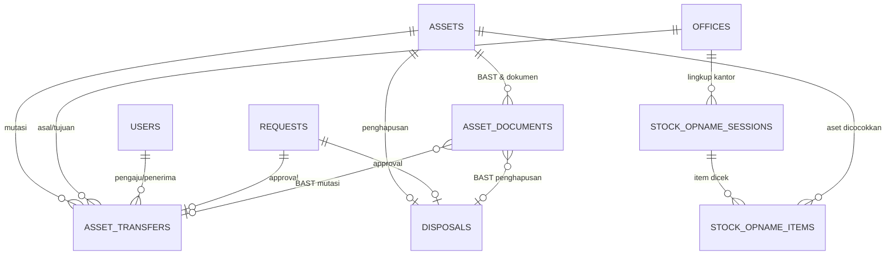
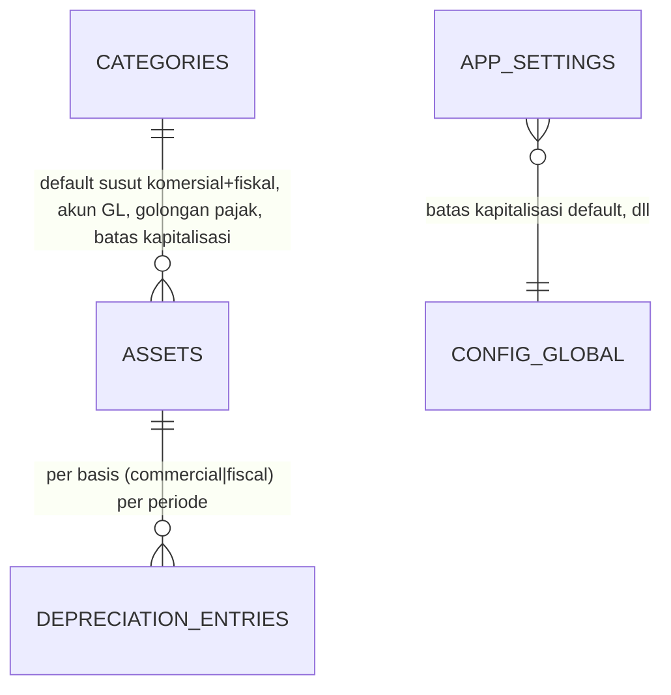

# Inventra — Desain Database

| | |
|---|---|
| **Produk** | Inventra (Asset Management System) |
| **Database** | PostgreSQL 16 |
| **Akses kode** | sqlc (type-safe) · migrasi golang-migrate |
| **Sumber kebenaran** | Dokumen ini menjabarkan [PRD.md §6](PRD.md) menjadi skema konkret |
| **Tanggal** | 2026-06-26 (selaras PRD v1.1 — Bank Fixed Asset Management) |
| **ERD ringkas** | Lihat [ERD.md](ERD.md) untuk diagram relasi konsolidasi seluruh skema |

> **Catatan versi & strategi migrasi (greenfield).** Karena belum ada data produksi, perubahan PRD
> v1.1 **di-bake langsung ke migrasi awal** (mengedit `000002`/`000006`/… in-place), **bukan** migrasi
> `ALTER` terpisah. Konsekuensinya: DB dev harus **direset** (`migrate down -all` / drop schema → `up`).
> Tabel/skema yang benar-benar baru (transfer/stockopname/disposal/dokumen) tetap jadi file migrasi
> baru di akhir. Bagian baru ditandai **🆕 v1.1**. Status saat ini: **enum + kolom `categories`
> sudah di-bake & ter-`sqlc generate`** (build hijau); sisanya menyusul per increment.

> Dokumen ini menjelaskan **seluruh database**: konvensi, tipe enum, relasi (ERD), dan
> kamus data (data dictionary) tiap tabel. Dibuat sebelum implementasi fitur agar skema,
> penamaan, dan integritas konsisten lintas modul.

---

## 1. Konvensi

| Aspek | Keputusan |
|---|---|
| **Primary key** | `id UUID PRIMARY KEY DEFAULT gen_random_uuid()` (pgcrypto, migrasi `000001_init`) |
| **Penamaan** | tabel `snake_case` jamak; kolom `snake_case`; FK `<entitas>_id` |
| **Schema (per modul)** | Tabel ditempatkan di **PostgreSQL schema per modul** (lihat §1.2). Enum & fungsi `set_updated_at` di schema `shared`; extensions di `public`. |
| **Timestamp (wajib)** | **Semua tabel** punya `created_at timestamptz NOT NULL DEFAULT now()` & `updated_at timestamptz NOT NULL DEFAULT now()` (di-update via trigger `set_updated_at()`). Pengecualian: tabel append-only `audit_logs` hanya `created_at`. |
| **Soft delete (semua tabel)** | Setiap tabel punya `deleted_at timestamptz NULL`. "Hapus" = set `deleted_at = now()` (+ catat di `audit_logs`); data tidak pernah dibuang fisik. Semua query default memfilter `WHERE deleted_at IS NULL`. |
| **Unique + soft delete** | Semua constraint UNIQUE memakai **partial index** `... WHERE deleted_at IS NULL` agar kode/email dapat dipakai ulang setelah baris dihapus. |
| **Jejak pengguna** | `created_by` (FK `users`) **hanya pada tabel operasional/transaksional** (assets, asset_attachments, assignments, maintenance_*, requests, import_jobs) — untuk scope `own` & tampilan. **`updated_by` tidak dipakai** (gunakan `audit_logs`). Master/referensi cukup `audit_logs`. |
| **Uang** | `numeric(18,2)` (mata uang default IDR) |
| **Rate/persen** | `numeric(5,4)` (mis. salvage rate 0.1000 = 10%) |
| **Periode depresiasi** | `date` pada hari-1 bulan (mis. `2026-06-01`) |
| **Enum vs tabel** | Himpunan **domain tetap** (status, dll) → ENUM PostgreSQL (§2). Himpunan yang **dapat dikonfigurasi superadmin** (peran) → **tabel** `roles` (§4.1), bukan enum. |
| **`is_active` ≠ `deleted_at`** | `is_active boolean DEFAULT true` = toggle bisnis (aktif/nonaktif, FR-7.5) pada master data; `deleted_at` = terhapus. Keduanya berbeda dan bisa hidup berdampingan. |
| **Scoping** | tabel beroperasi-aset menyimpan `office_id` (didenormalisasi) untuk filter subtree; "kepemilikan" via `employee_id`/`created_by`. |
| **URL & ID** | UUID v4 aman ditampilkan di URL (tak bisa di-enumerasi) — **tidak ada** kolom `label_id` terpisah. URL ramah-baca memakai kode manusiawi yang ada (`asset_tag`, `offices.code`, `employees.code`) sebagai slug. |
| **FK on delete** | Dengan soft delete, FK fisik umumnya `RESTRICT`/`NO ACTION`; "cascade soft delete" (mis. attachment ikut terhapus saat aset dihapus) ditangani di service layer. |

### 1.1 Refinement terhadap PRD §6
- **Peran = tabel, bukan enum.** `user_role` enum diganti tabel **`roles`** (lihat §4.1) karena superadmin dapat menambah/mengubah peran. RBAC per-aksi dibuat data-driven via `role_permissions`. Referensi `role` di `users`, `field_permissions`, `data_scope_policies` menjadi `role_id` (FK `roles`).
- `data_scope_policies.module` memakai sentinel **`'*'`** (NOT NULL, default `'*'`) untuk baris default per-role — agar `UNIQUE(role_id, module)` dapat ditegakkan (NULL di Postgres dianggap distinct).
- `assets.office_id` ditambahkan (diturunkan dari `room → floor → office`) untuk mempercepat filter scoping.
- `assets.asset_tag` **adalah kode aset unik** (mis. `AST-2026-0001`, FR-2.2) sekaligus payload **barcode** (FR-2.12) — bukan dua hal berbeda.
- Soft delete & `created_at`/`updated_at` diterapkan ke seluruh tabel (lihat §1).

### 1.2 Organisasi Schema (per modul)

Tabel dipisah ke **PostgreSQL schema per modul**, selaras dengan modul backend (PRD §7). Batas modul jadi eksplisit di level database; FK lintas-schema tetap diperbolehkan.

| Schema | Isi |
|---|---|
| `shared` | Semua **tipe enum** (§2) + fungsi trigger `set_updated_at()` — kosakata bersama |
| `identity` | `roles`, `role_permissions`, `users`, `field_permissions`, `data_scope_policies` |
| `audit` | `audit_logs` |
| `masterdata` | offices, floors, rooms, provinces, cities, office_types, departments, positions, employees, vendors, brands, models, categories, maintenance_categories, problem_categories, units *(fase 3)* |
| `asset` | assets, asset_attachments, asset_tag_counters *(fase 4)*; **🆕 v1.1** `asset_documents` (BAST) |
| `assignment` · `maintenance` · `depreciation` · `approval` · `import` | tabel modul masing-masing *(fase berikutnya)*. **🆕 v1.1** `approval`: `approval_thresholds`, `request_approvals` |
| **🆕 `transfer`** | `asset_transfers` (mutasi antar-kantor) *(v1.1)* |
| **🆕 `stockopname`** | `stock_opname_sessions`, `stock_opname_items` (inventarisasi fisik) *(v1.1)* |
| **🆕 `disposal`** | `disposals` (penghapusan/pelepasan + laba/rugi) *(v1.1)* |
| `identity` (+) | **🆕 v1.1** `app_settings` (config global terkelola: batas kapitalisasi, dll) |
| `public` | extensions (`pgcrypto`, `citext`) + tabel bookkeeping `schema_migrations` (golang-migrate) |

- **Referensi:** tipe enum diacu sebagai `shared.<enum>`; fungsi trigger `shared.set_updated_at()`; tabel diacu schema-qualified (mis. `identity.users`).
- **Aplikasi:** koneksi backend memakai `search_path` yang mencakup schema modul + `shared,public` (atau query schema-qualified via sqlc). `gen_random_uuid()`/`citext` tetap resolve via `public` di search_path.

---

## 2. Tipe Enum

> **Peran (role) BUKAN enum** — disimpan di tabel `roles` (§4.1) agar dapat dikonfigurasi superadmin.
> Semua tipe enum di bawah dibuat di schema **`shared`** (diacu sebagai `shared.<enum>`, mis. `shared.user_status`).

```sql
-- Inti (migrasi 000002, sudah diterapkan)
CREATE TYPE user_status         AS ENUM ('active','inactive','suspended');
CREATE TYPE scope_level         AS ENUM ('global','office_subtree','office','own');
CREATE TYPE asset_status        AS ENUM ('available','assigned','under_maintenance','retired','lost');
CREATE TYPE depreciation_method AS ENUM ('straight_line','declining_balance');
CREATE TYPE assignment_status   AS ENUM ('active','returned');
CREATE TYPE maintenance_type    AS ENUM ('preventive','corrective');
CREATE TYPE maintenance_status  AS ENUM ('scheduled','in_progress','completed','cancelled');
CREATE TYPE request_type        AS ENUM ('asset_create','asset_delete','assignment','maintenance','valuation_exclusion');
CREATE TYPE request_status      AS ENUM ('pending','approved','rejected','cancelled');
CREATE TYPE attachment_kind     AS ENUM ('photo','document');
CREATE TYPE import_status       AS ENUM ('pending','processing','completed','failed');
CREATE TYPE audit_action        AS ENUM ('create','update','delete');
```

```sql
-- 🆕 v1.1 — tipe baru (migrasi 000015)
CREATE TYPE asset_class          AS ENUM ('tangible','intangible');
CREATE TYPE depreciation_basis   AS ENUM ('commercial','fiscal');   -- komersial (PSAK 16) vs fiskal (PMK 72/2023)
CREATE TYPE fiscal_asset_group   AS ENUM ('kelompok_1','kelompok_2','kelompok_3','kelompok_4',
                                          'bangunan_permanen','bangunan_non_permanen','non_susut'); -- non_susut: tanah/intangible per kebijakan
CREATE TYPE transfer_status      AS ENUM ('pending','approved','in_transit','received','rejected','cancelled');
CREATE TYPE opname_session_status AS ENUM ('open','counting','reconciling','closed');
CREATE TYPE opname_item_result   AS ENUM ('pending','found','not_found','damaged','misplaced');
CREATE TYPE disposal_method      AS ENUM ('sale','auction','donation','write_off');
CREATE TYPE approver_level       AS ENUM ('office','office_subtree','wilayah','pusat');
CREATE TYPE asset_document_type  AS ENUM ('bast_acquisition','bast_transfer','bast_disposal','invoice','contract','other');
```

```sql
-- 🆕 v1.1 — perluasan enum yang sudah ada (migrasi 000015; tiap ADD VALUE pada statement terpisah)
ALTER TYPE asset_status ADD VALUE IF NOT EXISTS 'in_transfer';
ALTER TYPE asset_status ADD VALUE IF NOT EXISTS 'disposed';
ALTER TYPE request_type ADD VALUE IF NOT EXISTS 'asset_transfer';
ALTER TYPE request_type ADD VALUE IF NOT EXISTS 'asset_disposal';  -- 'asset_delete' lama disetarakan → asset_disposal
```

> **Catatan enum (penting):** `ALTER TYPE ... ADD VALUE` **tidak boleh** dipakai pada nilai yang sama di
> dalam transaksi yang juga memakai nilai itu. Karena golang-migrate membungkus tiap migrasi dalam satu
> transaksi, **migrasi 000015 hanya menambah nilai enum** (tanpa memakainya); pemakaian nilai baru
> (kolom/constraint/seed) dilakukan di migrasi berikutnya (000016+). `disposed`/`in_transfer` melengkapi
> state machine PRD §5; `retired` lama dipertahankan untuk kompatibilitas.

> `assignment.status = active` yang melewati `due_date` dianggap **overdue** (turunan, bukan kolom).
> Penyusutan **dua basis** memakai `depreciation_basis` di `depreciation_entries` (komersial & fiskal).

---

## 3. ERD (Relasi)

### 3.1 Identity & Otorisasi


### 3.2 Master Data & Struktur Kantor


### 3.3 Aset & Operasional


### 3.4 Approval, Audit & Import


### 3.5 🆕 v1.1 — Mutasi, Stock Opname, Disposal & Dokumen


### 3.6 🆕 v1.1 — Penyusutan dua basis & atribut akuntansi/pajak


---

## 4. Kamus Data (Data Dictionary)

Notasi: **PK** primary key · **FK** foreign key · `?` nullable.

> **Kolom implisit di SEMUA tabel** (tidak diulang di tiap baris, lihat §1): `created_at`, `updated_at`, `deleted_at` (soft delete). `audit_logs` hanya `created_at`. Semua `UNIQUE` adalah partial `WHERE deleted_at IS NULL`.

### 4.1 Identity & Otorisasi  · schema `identity`

#### `roles` — peran (dapat dikonfigurasi superadmin)
| Kolom | Tipe | Null | Default | Keterangan |
|---|---|---|---|---|
| id | uuid | no | gen_random_uuid() | **PK** |
| code | text | no | | **UNIQUE** — referensi stabil (mis. `superadmin`, `kepala_kanwil`, `kepala_unit`, `manager`, `staf`) |
| name | text | no | | nama tampil |
| description | text? | yes | | |
| is_system | boolean | no | false | `true` = peran bawaan; tak dapat dihapus & `code`-nya terkunci |

Index: partial `UNIQUE(code)`. Seed: 5 peran bawaan `is_system=true`. Superadmin dapat menambah peran kustom.

#### `role_permissions` — RBAC per-aksi (data-driven, menggantikan matriks hardcoded)
| Kolom | Tipe | Null | Keterangan |
|---|---|---|---|
| id | uuid | no | **PK** |
| role_id | uuid | no | **FK** roles |
| permission_key | text | no | kunci aksi, mis. `asset.create`, `asset.checkout`, `request.approve`, `user.manage`, `report.export` — katalog kunci di-seed dari matriks PRD §2.1 |

Index: partial `UNIQUE(role_id, permission_key)`, `idx_role_permissions_role`. Ditembolok di Redis.

#### `users`
| Kolom | Tipe | Null | Default | Keterangan |
|---|---|---|---|---|
| id | uuid | no | gen_random_uuid() | **PK** |
| employee_id | uuid? | yes | | **FK** employees — pegawai tertaut |
| office_id | uuid? | yes | | **FK** offices — kantor penempatan / jangkar scoping (NULL = global, untuk superadmin) |
| name | text | no | | nama tampil |
| email | citext | no | | **UNIQUE** (partial) |
| password_hash | text? | yes | | NULL bila login hanya via Google |
| google_id | text? | yes | | **UNIQUE** (partial) — subject Google OAuth |
| avatar_url | text? | yes | | |
| role_id | uuid | no | | **FK** roles (default = peran `staf`) |
| status | user_status | no | 'active' | |

Index: partial `UNIQUE(email)`, partial `UNIQUE(google_id)`, `idx_users_office_id`, `idx_users_role_id`, `idx_users_employee_id`.

#### `field_permissions` — hak akses per-field per-role (§2.3 PRD, **semua entitas**)
| Kolom | Tipe | Null | Default | Keterangan |
|---|---|---|---|---|
| id | uuid | no | gen_random_uuid() | **PK** |
| entity | text | no | | nama entitas (mis. `assets`) |
| field | text | no | | nama field |
| role_id | uuid | no | | **FK** roles |
| can_view | boolean | no | true | |
| can_edit | boolean | no | false | |

Index: partial `UNIQUE(entity, field, role_id)`, `idx_field_permissions_role`. Ditembolok di Redis; invalidasi saat berubah.

#### `data_scope_policies` — lingkup data per-role (+ override per-modul) (§2.2 PRD)
| Kolom | Tipe | Null | Default | Keterangan |
|---|---|---|---|---|
| id | uuid | no | gen_random_uuid() | **PK** |
| role_id | uuid | no | | **FK** roles |
| module | text | no | '*' | `'*'` = default semua modul; mis. `assets`, `requests` = override |
| scope_level | scope_level | no | | global / office_subtree / office / own |

Index: partial `UNIQUE(role_id, module)`, `idx_data_scope_role`.

#### `app_settings` — konfigurasi global terkelola superadmin 🆕 v1.1
| Kolom | Tipe | Null | Default | Keterangan |
|---|---|---|---|---|
| id | uuid | no | gen_random_uuid() | **PK** |
| key | text | no | | **UNIQUE** — mis. `capitalization_threshold_default`, `currency`, `depreciation_run_day` |
| value | text | no | | nilai (di-parse sesuai `value_type`) |
| value_type | text? | yes | | `number`/`string`/`bool`/`json` (hint parsing) |
| description | text? | yes | | keterangan untuk UI pengaturan |

Index: partial `UNIQUE(key)`. Ditembolok di Redis (invalidasi saat berubah). Seed: `capitalization_threshold_default = 1000000` (⚠️ placeholder, kebijakan bank). Dipakai FR-2.13 / FR-7.7.

### 4.2 Master Data — Referensi & Geografi

#### `provinces`
| Kolom | Tipe | Null | Keterangan |
|---|---|---|---|
| id | uuid | no | **PK** |
| name | text | no | |
| code | text? | yes | **UNIQUE** (kode BPS opsional) |
| created_at / updated_at | timestamptz | no | |

#### `cities`
| id | uuid | no | **PK** |
| province_id | uuid | no | **FK** provinces |
| name | text | no | |
| code | text? | yes | **UNIQUE** |
| ts | timestamptz | no | created/updated |

#### `office_types`
| id | uuid PK · name text UNIQUE (Pusat/Wilayah/Cabang/Outlet) · is_active bool · ts |

#### `departments`
| id | uuid PK · name text · code text? UNIQUE · is_active bool · ts |

#### `positions`
| id | uuid PK · name text · is_active bool · ts |

#### `vendors`
| id uuid PK · name text · contact_name text? · phone text? · email text? · address text? · is_active bool · ts |

#### `brands`
| id uuid PK · name text UNIQUE · is_active bool · ts |

#### `models`
| id uuid PK · brand_id uuid **FK** brands · name text · is_active bool · ts · **UNIQUE(brand_id, name)** |

#### `categories` — kategori aset
| Kolom | Tipe | Null | Keterangan |
|---|---|---|---|
| id | uuid | no | **PK** |
| name | text | no | |
| code | text? | yes | **UNIQUE** |
| parent_id | uuid? | yes | **FK** categories (hierarki) |
| default_depreciation_method | depreciation_method? | yes | nilai default **komersial** untuk aset |
| default_useful_life_months | int? | yes | masa manfaat **komersial** (PSAK) |
| default_salvage_rate | numeric(5,4)? | yes | |
| **asset_class** 🆕 | asset_class | no | default `tangible` — `intangible` untuk software/lisensi (PSAK 19) |
| **default_fiscal_group** 🆕 | fiscal_asset_group? | yes | golongan pajak/kelompok harta (PMK 72/2023) — lihat PRD Lampiran A |
| **default_fiscal_life_months** 🆕 | int? | yes | masa manfaat **fiskal** (mis. Kelompok 1 = 48 bln) |
| **gl_account_code** 🆕 | text? | yes | akun GL/COA untuk posting (output siap-jurnal) |
| **capitalization_threshold** 🆕 | numeric(18,2)? | yes | override batas kapitalisasi (NULL = pakai default global `app_settings`) |
| is_active | boolean | no | |
| ts | timestamptz | no | |

> 🆕 v1.1: kolom di atas ditambah via `ALTER TABLE` (migrasi 000016). `default_fiscal_group` (enum)
> menggantikan kebutuhan kolom `tax_group` tekstual terpisah — golongan pajak = kelompok harta fiskal.

#### `maintenance_categories`
| id uuid PK · name text UNIQUE · is_active bool · ts | (mis. Servis Rutin, Kalibrasi) |

#### `problem_categories`
| id uuid PK · name text UNIQUE · is_active bool · ts | (mis. Hardware, Listrik, Fisik) |

#### `units` — satuan
| id uuid PK · name text · symbol text? · is_active bool · ts | (mis. Unit/Pcs/Set) |

### 4.3 Master Data — Struktur Kantor & Orang

#### `offices` — hierarki Pusat → Wilayah → Cabang → Outlet
| Kolom | Tipe | Null | Keterangan |
|---|---|---|---|
| id | uuid | no | **PK** |
| parent_id | uuid? | yes | **FK** offices (self) — NULL = akar (Pusat) |
| office_type_id | uuid | no | **FK** office_types |
| province_id | uuid? | yes | **FK** provinces |
| city_id | uuid? | yes | **FK** cities |
| name | text | no | |
| code | text | no | **UNIQUE** |
| **cost_center_code** 🆕 | text? | yes | kode cost center / unit kerja (pembebanan biaya, output jurnal) |
| address | text? | yes | |
| is_active | boolean | no | |
| ts | timestamptz | no | |

Index: `idx_offices_parent_id`, `UNIQUE(code)`. Lihat §5 untuk komputasi subtree.

> **Hierarki tetap 4 jenjang** (Pusat → Wilayah → Cabang/Unit → Outlet) via `parent_id`; `office_type`
> boleh banyak label tanpa menambah kedalaman. `cost_center_code` ditambah migrasi 000016 (🆕 v1.1).

#### `floors`
| id uuid PK · office_id uuid **FK** offices · name text · level int? · ts · **UNIQUE(office_id, name)** |

#### `rooms`
| id uuid PK · floor_id uuid **FK** floors · name text · code text? · ts · **UNIQUE(floor_id, name)** |

#### `employees` — data pegawai (custodian aset)

**Apa & kenapa terpisah dari `users`.** `employees` adalah **master data orang** dalam organisasi — daftar pegawai yang dapat **memegang/bertanggung jawab atas aset** (custodian). Ini sengaja **dipisahkan dari `users`** (akun login) karena:
- **Tidak semua pegawai punya akun aplikasi.** Aset bisa ditugaskan ke pegawai yang tidak pernah login (mis. petugas lapangan). Memaksa setiap custodian punya akun akan kotor & tidak realistis.
- **Pemisahan kepedulian.** `users` mengurus *autentikasi & otorisasi* (peran, scoping); `employees` mengurus *identitas kepegawaian* (NIP, departemen, jabatan, penempatan). Satu pegawai bisa berhenti login tetapi tetap tercatat sebagai pemegang aset historis.
- **Penautan opsional.** Satu `user` boleh ditautkan ke satu `employee` via `users.employee_id`. Saat tertaut, "data milik saya" (scope `own`) dipetakan ke aset yang dipegang `employee` tersebut.

**Peran dalam relasi:** menjadi target `assignments.employee_id` dan `assets.current_holder_employee_id` (pemegang aktif).

| Kolom | Tipe | Null | Keterangan |
|---|---|---|---|
| id | uuid | no | **PK** |
| code | text | no | **UNIQUE** (partial) — NIP/kode pegawai; dapat dipakai sebagai slug URL |
| name | text | no | nama lengkap |
| email | text? | yes | email kantor (informasional; bukan kredensial login) |
| avatar_key | text? | yes | foto pegawai — objek di **MinIO** (dikompres + thumbnail saat unggah, mengikuti FR-2.6); diakses via presigned/proxy |
| department_id | uuid? | yes | **FK** departments |
| position_id | uuid? | yes | **FK** positions — jabatan |
| office_id | uuid | no | **FK** offices — kantor penempatan |
| status | user_status | no | active/inactive (mis. pegawai nonaktif/pensiun) |

Index: partial `UNIQUE(code)`, `idx_employees_office_id`, `idx_employees_department_id`, `idx_employees_position_id`.

### 4.4 Aset & Operasional

#### `assets`
| Kolom | Tipe | Null | Default | Keterangan |
|---|---|---|---|---|
| id | uuid | no | gen_random_uuid() | **PK** |
| asset_tag | text | no | | **UNIQUE** (partial) — **kode aset** unik, format `<kode_kantor>-<kode_kategori>-<tahun>-<seq5>` (lihat §4.7) = payload **barcode** Code128 (FR-2.12); slug URL |
| name | text | no | | |
| category_id | uuid | no | | **FK** categories |
| brand_id | uuid? | yes | | **FK** brands |
| model_id | uuid? | yes | | **FK** models |
| room_id | uuid? | yes 🆕 | | **FK** rooms — lokasi fisik (NULL untuk aset **intangible**) |
| office_id | uuid | no | | **FK** offices — diturunkan dari room (tangible) / kantor pengelola (intangible), untuk scoping |
| unit_id | uuid? | yes | | **FK** units |
| status | asset_status | no | 'available' | state machine PRD §5 (+ `in_transfer`/`disposed` 🆕) |
| serial_number | text? | yes | | |
| purchase_date | date? | yes | | tanggal perolehan |
| purchase_cost | numeric(18,2)? | yes | | harga/nilai perolehan |
| vendor_id | uuid? | yes | | **FK** vendors |
| **po_number** 🆕 | text? | yes | | nomor PO/kontrak pengadaan |
| **funding_source** 🆕 | text? | yes | | sumber dana |
| warranty_expiry | date? | yes | | |
| specifications | jsonb | no | '{}' | atribut fleksibel |
| **asset_class** 🆕 | asset_class | no | 'tangible' | tangible / intangible (warisan default kategori) |
| **capitalized** 🆕 | boolean | no | true | `false` = di bawah batas kapitalisasi → dibebankan, tak disusutkan (FR-2.13) |
| depreciation_method | depreciation_method? | yes | | metode **komersial**; override default kategori |
| useful_life_months | int? | yes | | masa manfaat **komersial** |
| salvage_value | numeric(18,2)? | yes | | nilai sisa |
| **fiscal_group** 🆕 | fiscal_asset_group? | yes | | golongan pajak/kelompok harta (PMK 72/2023) |
| **fiscal_life_months** 🆕 | int? | yes | | masa manfaat **fiskal** |
| **accumulated_depreciation** 🆕 | numeric(18,2) | no | 0 | akumulasi penyusutan **komersial** (ringkasan; rincian di `depreciation_entries`) |
| **book_value** 🆕 | numeric(18,2)? | yes | | nilai buku berjalan (perolehan − akum. susut − impairment) |
| **impairment_loss** 🆕 | numeric(18,2)? | yes | | akumulasi rugi penurunan nilai (PSAK 48, FR-5.4) |
| **acquisition_bast_no** 🆕 | text? | yes | | nomor BAST perolehan (dokumen lengkap di `asset_documents`) |
| current_holder_employee_id | uuid? | yes | | **FK** employees — pemegang aktif |
| excluded_from_valuation | boolean | no | false | hasil approval (§3.6) |
| valuation_exclusion_reason | text? | yes | | |
| created_by_id | uuid? | yes | | **FK** users |
| notes | text? | yes | | |
| ts | timestamptz | no | now() | created/updated |

Index: `UNIQUE(asset_tag)`, `idx_assets_office_id`, `idx_assets_status`, `idx_assets_category_id`, `idx_assets_holder`, `idx_assets_class` 🆕.

> 🆕 v1.1 (migrasi 000016): kolom akuntansi/pajak & intangible ditambah via `ALTER TABLE`; `room_id`
> dilonggarkan jadi nullable. **Aturan integritas:** aset `tangible` **wajib** `room_id` (CHECK
> `asset_class='intangible' OR room_id IS NOT NULL`); aset `intangible` tak punya `room_id`/barcode/stock-opname.

#### `asset_attachments` — file di MinIO
| id uuid PK · asset_id uuid **FK** assets `ON DELETE CASCADE` · kind attachment_kind · object_key text · thumbnail_key text? · original_filename text · size_bytes bigint · mime_type text · created_by_id uuid? **FK** users · created_at timestamptz |

Index: `idx_attachments_asset_id`.

#### `assignments` — check-out / check-in
| Kolom | Tipe | Null | Keterangan |
|---|---|---|---|
| id | uuid | no | **PK** |
| asset_id | uuid | no | **FK** assets |
| employee_id | uuid | no | **FK** employees (custodian) |
| assigned_by_id | uuid | no | **FK** users |
| checkout_date | timestamptz | no | |
| due_date | date? | yes | jatuh tempo |
| checkin_date | timestamptz? | yes | NULL = masih dipegang |
| condition_out | text? | yes | kondisi keluar |
| condition_in | text? | yes | kondisi masuk |
| status | assignment_status | no | active/returned |
| notes | text? | yes | |
| ts | timestamptz | no | |

Index: `idx_assignments_asset_id`, `idx_assignments_employee_id`, `idx_assignments_status`. Aturan: hanya **satu** assignment `active` per aset (partial unique index `WHERE status='active'`).

#### `maintenance_schedules`
| id uuid PK · asset_id uuid **FK** assets · maintenance_category_id uuid? **FK** · interval_months int · last_done_date date? · next_due_date date · is_active bool · ts |

Index: `idx_msched_next_due` (reminder).

#### `maintenance_records`
| Kolom | Tipe | Null | Keterangan |
|---|---|---|---|
| id | uuid | no | **PK** |
| asset_id | uuid | no | **FK** assets |
| maintenance_category_id | uuid? | yes | **FK** maintenance_categories |
| problem_category_id | uuid? | yes | **FK** problem_categories (laporan kerusakan) |
| type | maintenance_type | no | preventive/corrective |
| status | maintenance_status | no | default 'scheduled' |
| scheduled_date | date? | yes | |
| completed_date | date? | yes | |
| cost | numeric(18,2)? | yes | |
| vendor_id | uuid? | yes | **FK** vendors |
| performed_by | text? | yes | teknisi |
| description | text | no | |
| reported_by_id | uuid? | yes | **FK** users (pelapor) |
| ts | timestamptz | no | |

Index: `idx_mrec_asset_status`.

#### `depreciation_entries` (read model) — **dua basis** 🆕 v1.1
| id uuid PK · asset_id uuid **FK** assets · **basis depreciation_basis** 🆕 (`commercial`/`fiscal`) · period date · opening_value numeric(18,2) · depreciation_amount numeric(18,2) · closing_value numeric(18,2) · method depreciation_method · created_at · **UNIQUE(asset_id, basis, period)** 🆕 |

Index: `idx_depr_asset_basis_period`.

> 🆕 v1.1 (migrasi 000016): kolom `basis` ditambah; UNIQUE diperluas ke `(asset_id, basis, period)`
> agar baris **komersial** & **fiskal** untuk periode sama dapat hidup berdampingan. Aset intangible
> memakai jalur **amortisasi** (entri `basis='commercial'`, istilah laporan = amortisasi). Aset dengan
> `capitalized=false` atau `fiscal_group='non_susut'` tidak menghasilkan entri.

### 4.5 Approval, Audit & Import

#### `requests` — maker-checker generik (§3.6 PRD)
| Kolom | Tipe | Null | Keterangan |
|---|---|---|---|
| id | uuid | no | **PK** |
| type | request_type | no | asset_create / asset_disposal / asset_transfer 🆕 / assignment / maintenance / valuation_exclusion |
| office_id | uuid? | yes | **FK** offices — routing approver berjenjang |
| **amount** 🆕 | numeric(18,2)? | yes | nilai transaksi (perolehan/nilai buku) — dasar pemilihan band `approval_thresholds` (§2.4 PRD) |
| **current_step** 🆕 | int | no | langkah rantai persetujuan berjalan (default 1) |
| target_entity | text? | yes | entitas terkait (mis. `assets`) |
| target_id | uuid? | yes | ID objek eksisting (untuk disposal/exclusion/transfer) |
| payload | jsonb | no | data usulan |
| reason | text? | yes | |
| status | request_status | no | default 'pending' |
| requested_by_id | uuid | no | **FK** users (maker) |
| decided_by_id | uuid? | yes | **FK** users (pemutus akhir) |
| decision_note | text? | yes | |
| decided_at | timestamptz? | yes | |
| ts | timestamptz | no | created/updated |

Index: `idx_requests_status_type`, `idx_requests_office_id`, `idx_requests_requester`. Aturan: `requested_by_id <> decided_by_id` (segregation of duty, §FR-6.4). 🆕 v1.1: persetujuan **berjenjang per nilai** dirinci di `request_approvals`; `amount`/`current_step` ditambah migrasi 000016.

#### `approval_thresholds` — limit otorisasi berjenjang per nilai 🆕 v1.1 (§2.4 PRD)
| Kolom | Tipe | Null | Default | Keterangan |
|---|---|---|---|---|
| id | uuid | no | gen_random_uuid() | **PK** |
| request_type | request_type | no | | jenis transaksi (asset_disposal / asset_create / asset_transfer / …) |
| amount_from | numeric(18,2) | no | 0 | batas bawah band (inklusif) |
| amount_to | numeric(18,2)? | yes | | batas atas band (eksklusif); NULL = tak terbatas (∞) |
| required_level | approver_level | no | | jenjang approver tertinggi wajib (office/office_subtree/wilayah/pusat) |
| step_order | int | no | 1 | urutan langkah dalam rantai (maker → checker → approver berlapis) |
| is_active | boolean | no | true | |

Index: `idx_apprthr_type`, partial `UNIQUE(request_type, amount_from, step_order)`. Ditembolok Redis. Seed: band placeholder PRD §2.4 (⚠️ kebijakan bank). Aturan: band per `request_type` tidak boleh tumpang tindih.

#### `request_approvals` — jejak rantai persetujuan per langkah 🆕 v1.1 (§3.6 PRD)
| Kolom | Tipe | Null | Default | Keterangan |
|---|---|---|---|---|
| id | uuid | no | gen_random_uuid() | **PK** |
| request_id | uuid | no | | **FK** requests `ON DELETE CASCADE` |
| step_order | int | no | | urutan langkah |
| required_level | approver_level | no | | jenjang yang diharapkan pada langkah ini |
| approver_id | uuid? | yes | | **FK** users — pemutus langkah (NULL = belum) |
| decision | request_status | no | 'pending' | pending / approved / rejected |
| note | text? | yes | | catatan keputusan |
| decided_at | timestamptz? | yes | | |

Index: partial `UNIQUE(request_id, step_order)`, `idx_reqappr_request`, `idx_reqappr_approver`. Aturan: tiap `approver_id` dalam satu request harus **berbeda** dan **≠ maker** (SoD, §FR-6.4).

#### `audit_logs` — jejak seluruh tabel (§5.7 PRD)
| id uuid PK · actor_id uuid? **FK** users · entity_type text · entity_id uuid · action audit_action · changes jsonb (diff before/after) · ip text? · created_at timestamptz |

Index: `idx_audit_entity (entity_type, entity_id)`, `idx_audit_actor`, `idx_audit_created_at`. Diisi terpusat (decorator service/repository), bukan per-handler.

#### `import_jobs` — import massal CSV/XLSX (FR-2.11 / FR-7.5b)
| id uuid PK · target text (asset/employee/office/…) · format text (csv/xlsx) · filename text · object_key text? (sumber di MinIO) · status import_status · total_rows int · success_rows int · failed_rows int · error_report_key text? (laporan error di MinIO) · created_by_id uuid **FK** users · created_at · finished_at timestamptz? |

Index: `idx_import_created_by`, `idx_import_status`.

### 4.5b 🆕 v1.1 — Mutasi, Stock Opname, Disposal & Dokumen

#### `asset_documents` — BAST & dokumen resmi · schema `asset`
| Kolom | Tipe | Null | Keterangan |
|---|---|---|---|
| id | uuid | no | **PK** |
| asset_id | uuid | no | **FK** assets `ON DELETE CASCADE` |
| doc_type | asset_document_type | no | bast_acquisition / bast_transfer / bast_disposal / invoice / contract / other |
| doc_no | text? | yes | nomor dokumen/BAST |
| doc_date | date? | yes | tanggal dokumen |
| counterparty | text? | yes | pihak terkait (vendor, kantor tujuan, pembeli) |
| object_key | text? | yes | berkas di **MinIO** (presigned/proxy) |
| related_request_id | uuid? | yes | **FK** requests |
| related_transfer_id | uuid? | yes | **FK** asset_transfers |
| related_disposal_id | uuid? | yes | **FK** disposals |
| created_by_id | uuid? | yes | **FK** users |

Index: `idx_assetdoc_asset`, `idx_assetdoc_type`. Mengikuti hak akses & scope aset terkait.

#### `asset_transfers` — mutasi antar-kantor · schema `transfer` (§3.8 PRD)
| Kolom | Tipe | Null | Keterangan |
|---|---|---|---|
| id | uuid | no | **PK** |
| asset_id | uuid | no | **FK** assets |
| from_office_id | uuid | no | **FK** offices — kantor asal |
| to_office_id | uuid | no | **FK** offices — kantor tujuan |
| to_room_id | uuid? | yes | **FK** rooms — ruangan tujuan (diisi saat diterima) |
| status | transfer_status | no | pending / approved / in_transit / received / rejected / cancelled |
| reason | text? | yes | alasan mutasi |
| requested_by_id | uuid | no | **FK** users (pengaju) |
| approved_by_id | uuid? | yes | **FK** users |
| shipped_date | date? | yes | |
| received_date | date? | yes | |
| received_by_id | uuid? | yes | **FK** users (penerima di tujuan) |
| bast_no | text? | yes | nomor BAST mutasi |
| request_id | uuid? | yes | **FK** requests (approval berjenjang) |
| notes | text? | yes | |

Index: `idx_transfer_asset`, `idx_transfer_from`, `idx_transfer_to`, `idx_transfer_status`. Saat `received`: `assets.office_id`/`room_id` diperbarui (service layer). Scope ditegakkan di sisi asal **dan** tujuan.

#### `stock_opname_sessions` — sesi inventarisasi fisik · schema `stockopname` (§3.9 PRD)
| Kolom | Tipe | Null | Keterangan |
|---|---|---|---|
| id | uuid | no | **PK** |
| office_id | uuid | no | **FK** offices — lingkup kantor sesi |
| name | text? | yes | label sesi (mis. "Opname Tahunan 2026") |
| period | date | no | periode (hari-1 bulan) |
| status | opname_session_status | no | open / counting / reconciling / closed |
| started_by_id | uuid | no | **FK** users |
| started_at | timestamptz | no | |
| closed_by_id | uuid? | yes | **FK** users |
| closed_at | timestamptz? | yes | |

Index: `idx_opname_office`, `idx_opname_status`.

#### `stock_opname_items` — hasil pencocokan per aset · schema `stockopname`
| Kolom | Tipe | Null | Keterangan |
|---|---|---|---|
| id | uuid | no | **PK** |
| session_id | uuid | no | **FK** stock_opname_sessions `ON DELETE CASCADE` |
| asset_id | uuid | no | **FK** assets |
| expected | boolean | no | `true` = terdaftar di snapshot register saat sesi dibuka |
| result | opname_item_result | no | pending / found / not_found / damaged / misplaced |
| counted_by_id | uuid? | yes | **FK** users |
| counted_at | timestamptz? | yes | |
| note | text? | yes | mis. lokasi ditemukan (untuk `misplaced`) |

Index: partial `UNIQUE(session_id, asset_id)`, `idx_opnitem_session`, `idx_opnitem_result`. Selisih (variance) = item `expected=true & result IN (not_found)` atau aset fisik tak ber-`expected`.

#### `disposals` — penghapusan/pelepasan · schema `disposal` (§3.6/§5 PRD)
| Kolom | Tipe | Null | Keterangan |
|---|---|---|---|
| id | uuid | no | **PK** |
| asset_id | uuid | no | **FK** assets — `UNIQUE` (satu disposal final per aset) |
| method | disposal_method | no | sale / auction / donation / write_off |
| disposal_date | date | no | tanggal pelepasan |
| proceeds | numeric(18,2)? | yes | nilai jual/lelang (0 untuk write_off/hibah) |
| book_value_at_disposal | numeric(18,2)? | yes | nilai buku saat dilepas |
| gain_loss | numeric(18,2)? | yes | laba/(rugi) pelepasan = proceeds − book_value (output jurnal) |
| bast_no | text? | yes | nomor BAST penghapusan |
| approved_by_id | uuid? | yes | **FK** users (pemutus akhir, sesuai limit otorisasi) |
| request_id | uuid? | yes | **FK** requests |
| created_by_id | uuid? | yes | **FK** users |

Index: partial `UNIQUE(asset_id)`, `idx_disposal_date`. Saat final: `assets.status → disposed` (service layer).

### 4.6 Ringkasan Index & Integritas

**Aturan umum (berlaku ke semua tabel):**
- **Setiap kolom FK diberi index** (PostgreSQL tidak membuatnya otomatis) — mempercepat join & cek `ON DELETE`.
- **Setiap UNIQUE adalah partial** `... WHERE deleted_at IS NULL`.
- **Index parsial soft-delete** untuk tabel yang sering di-list: `idx_<tabel>_active ON <tabel>(...) WHERE deleted_at IS NULL`.
- Kolom yang sering jadi **filter** (status, office_id, tanggal jatuh tempo) diberi index tersendiri.

**Daftar index per tabel (lengkap):**

| Tabel | Index |
|---|---|
| roles | `UNIQUE(code)` |
| role_permissions | `UNIQUE(role_id, permission_key)`, `idx_role_permissions_role` |
| users | `UNIQUE(email)`, `UNIQUE(google_id)`, `idx_users_office_id`, `idx_users_role_id`, `idx_users_employee_id` |
| field_permissions | `UNIQUE(entity, field, role_id)`, `idx_field_permissions_role` |
| data_scope_policies | `UNIQUE(role_id, module)`, `idx_data_scope_role` |
| provinces | `UNIQUE(code)` |
| cities | `UNIQUE(code)`, `idx_cities_province_id` |
| office_types · departments · positions · units | `UNIQUE(name/code)` |
| vendors | `idx_vendors_name` |
| brands | `UNIQUE(name)` |
| models | `UNIQUE(brand_id, name)`, `idx_models_brand_id` |
| categories | `UNIQUE(code)`, `idx_categories_parent_id` |
| maintenance_categories · problem_categories | `UNIQUE(name)` |
| offices | `UNIQUE(code)`, `idx_offices_parent_id`, `idx_offices_type_id`, `idx_offices_province_id`, `idx_offices_city_id` |
| floors | `UNIQUE(office_id, name)`, `idx_floors_office_id` |
| rooms | `UNIQUE(floor_id, name)`, `idx_rooms_floor_id` |
| employees | `UNIQUE(code)`, `idx_employees_office_id`, `idx_employees_department_id`, `idx_employees_position_id` |
| assets | `UNIQUE(asset_tag)`, `idx_assets_office_id`, `idx_assets_status`, `idx_assets_category_id`, `idx_assets_room_id`, `idx_assets_brand_id`, `idx_assets_model_id`, `idx_assets_vendor_id`, `idx_assets_unit_id`, `idx_assets_holder`, `idx_assets_created_by` |
| asset_attachments | `idx_attachments_asset_id`, `idx_attachments_created_by` |
| assignments | `idx_assignments_asset_id`, `idx_assignments_employee_id`, `idx_assignments_status`, `idx_assignments_assigned_by`, partial `UNIQUE(asset_id) WHERE status='active' AND deleted_at IS NULL` |
| maintenance_schedules | `idx_msched_asset_id`, `idx_msched_category_id`, `idx_msched_next_due` |
| maintenance_records | `idx_mrec_asset_id`, `idx_mrec_status`, `idx_mrec_category_id`, `idx_mrec_problem_id`, `idx_mrec_vendor_id`, `idx_mrec_reported_by` |
| depreciation_entries | `UNIQUE(asset_id, period)`, `idx_depr_asset_period` |
| requests | `idx_requests_status_type`, `idx_requests_office_id`, `idx_requests_requester`, `idx_requests_decided_by`, `idx_requests_target` |
| audit_logs | `idx_audit_entity(entity_type, entity_id)`, `idx_audit_actor`, `idx_audit_created_at` |
| import_jobs | `idx_import_created_by`, `idx_import_status` |
| asset_tag_counters | `UNIQUE(office_id, category_id, year)`, `idx_atc_office`, `idx_atc_category` |
| app_settings 🆕 | `UNIQUE(key)` |
| approval_thresholds 🆕 | `UNIQUE(request_type, amount_from, step_order)`, `idx_apprthr_type` |
| request_approvals 🆕 | `UNIQUE(request_id, step_order)`, `idx_reqappr_request`, `idx_reqappr_approver` |
| asset_documents 🆕 | `idx_assetdoc_asset`, `idx_assetdoc_type` |
| asset_transfers 🆕 | `idx_transfer_asset`, `idx_transfer_from`, `idx_transfer_to`, `idx_transfer_status` |
| stock_opname_sessions 🆕 | `idx_opname_office`, `idx_opname_status` |
| stock_opname_items 🆕 | `UNIQUE(session_id, asset_id)`, `idx_opnitem_session`, `idx_opnitem_result` |
| disposals 🆕 | `UNIQUE(asset_id)`, `idx_disposal_date` |

### 4.7 Generator `asset_tag` (kode aset)

**Format:** `<kode_kantor>-<kode_kategori>-<tahun_beli>-<seq5>`
- `kode_kantor` = `offices.code` (kantor aset)
- `kode_kategori` = `categories.code`
- `tahun_beli` = tahun dari `assets.purchase_date` (4 digit)
- `seq5` = nomor urut **5 digit** (zero-padded), berjalan **per kantor & kategori**, **direset tiap tahun**

Contoh: `JKT01-ELK-2026-00001`, `JKT01-ELK-2026-00002`; di kantor lain `JKT02-ELK-2026-00001` (tiap kantor mulai dari `00001`); tahun `2027` mulai `00001` lagi.

**Tabel counter** — sumber kebenaran nomor urut (dikecualikan dari soft delete; ini helper sequence):

| Kolom | Tipe | Null | Keterangan |
|---|---|---|---|
| id | uuid | no | **PK** |
| office_id | uuid | no | **FK** offices |
| category_id | uuid | no | **FK** categories |
| year | int | no | tahun |
| last_seq | int | no | nomor urut terakhir terpakai |

Index: `UNIQUE(office_id, category_id, year)`.

**Generasi atomik** (aman dari race tanpa perlu lock eksternal):
```sql
INSERT INTO asset_tag_counters (office_id, category_id, year, last_seq)
VALUES ($office_id, $category_id, $year, 1)
ON CONFLICT (office_id, category_id, year)
DO UPDATE SET last_seq = asset_tag_counters.last_seq + 1
RETURNING last_seq;
-- asset_tag = format('%s-%s-%s-%05d', office_code, category_code, year, last_seq)
```
`UNIQUE(asset_tag)` (partial) berlaku sebagai jaring pengaman. Redis lock **tidak diperlukan** karena upsert+`RETURNING` sudah atomik per baris.

**Catatan:**
- `purchase_date` **wajib** saat auto-generate (untuk `tahun_beli`); bila aset diinput tanpa tanggal beli, sistem meminta tahun atau memakai tahun berjalan.
- Sequence di-key oleh **(kantor, kategori, tahun)** — tiap kantor punya urutan terpisah, direset tiap tahun.

---

## 5. Scoping Hierarki Kantor

Lingkup `office_subtree` membutuhkan daftar **descendant** dari `office_id` user. Pendekatan:

```sql
WITH RECURSIVE subtree AS (
  SELECT id FROM masterdata.offices WHERE id = $1
  UNION ALL
  SELECT o.id FROM masterdata.offices o JOIN subtree s ON o.parent_id = s.id
)
SELECT id FROM subtree;
```

- Hasil (`descendant_ids`) **ditembolok di Redis** per `office_id` (mahal dihitung); invalidasi saat hierarki kantor berubah.
- Penegakan filter di service layer sesuai `scope_level` efektif (`data_scope_policies`):
  `global` → tanpa filter · `office_subtree` → `office_id IN (descendant_ids)` · `office` → `office_id = user.office_id` · `own` → `created_by/holder = user`.
- Alternatif performa (opsional, bila pohon sangat besar): kolom **materialized path** atau ekstensi **`ltree`**. Default: recursive CTE + cache.

---

## 6. Pemetaan ke Migrasi & Roadmap

Tiap fase roadmap (PRD §10) menambah migrasi `golang-migrate` di `backend/db/migrations`:

| Migrasi | Fase | Objek |
|---|---|---|
| `000001_init` | 1 | extension `pgcrypto` ✅ |
| `000002_enums` | 2 | schemas (shared/identity/audit) + `citext` + `shared.set_updated_at` + semua enum ✅ |
| `000003_identity` | 2 | `identity`: roles, role_permissions, users, field_permissions, data_scope_policies ✅ |
| `000004_audit_logs` | 2 | `audit`: audit_logs ✅ |
| `000005_seed_identity` | 2 | seed: 5 peran sistem, default data_scope_policies, RBAC (45 izin) ✅ |
| `000006_masterdata` | 3 | `masterdata`: provinces, cities, office_types, departments, positions, vendors, brands, models, categories, maintenance_categories, problem_categories, units ✅ |
| `000007_offices_employees` | 3 | `masterdata`: offices, floors, rooms, employees + FK `identity.users.{employee_id,office_id}` ✅ |
| `000008_asset` | 4 | `asset`: assets, asset_attachments, asset_tag_counters ✅ |
| `000009_import` | 4 | `import`: import_jobs ✅ |
| `000010_approval` | 5 | `approval`: requests (maker-checker, SoD check) ✅ |
| `000011_assignment` | 6 | `assignment`: assignments (1 aktif/aset) ✅ |
| `000012_maintenance` | 7 | `maintenance`: maintenance_schedules, maintenance_records ✅ |
| `000013_depreciation` | 8 | `depreciation`: depreciation_entries (read model) ✅ |
| `000014_audit_office` | 2 | `audit`: tambah `audit_logs.office_id` (scoping audit) ✅ |
| **`000015_fam_tables`** 🆕 | v1.1 | skema/tabel **baru**: `transfer.asset_transfers`, `disposal.disposals`, `stockopname.stock_opname_{sessions,items}`, `asset.asset_documents` (BAST) ✅ |

> **Strategi greenfield (PRD v1.1).** Karena belum ada data, perubahan v1.1 untuk tabel/enum yang
> **sudah ada** di-bake **in-place ke migrasi awal** (bukan migrasi `ALTER` terpisah):
> - `000002_enums` — 9 tipe baru (asset_class, depreciation_basis, fiscal_asset_group, transfer/opname/
>   disposal/approver/asset_document) + nilai baru `asset_status` (`in_transfer`,`disposed`) & `request_type`
>   (`asset_disposal`,`asset_transfer`).
> - `000003_identity` — `app_settings`. `000006_masterdata` — kolom GL/fiskal/kapitalisasi/asset_class di
>   `categories`. `000007` — `offices.cost_center_code`. `000008_asset` — kolom akuntansi/pajak/intangible
>   di `assets` + `room_id` nullable + CHECK. `000010_approval` — `requests.{amount,current_step}` +
>   `approval_thresholds` + `request_approvals`. `000013_depreciation` — `depreciation_entries.basis` +
>   UNIQUE`(asset_id, basis, period)`.
>
> Tabel/skema yang **benar-benar baru** → migrasi baru **`000015_fam_tables`**. Konsekuensi: DB dev harus
> **direset** (drop schemas CASCADE → `up`; *jangan* andalkan `down -all` saat ada user ter-seed, lihat
> catatan di bawah). Status: **semua di atas sudah ditulis & `sqlc generate` hijau**; `migrate up` penuh
> tervalidasi saat stack dev menyala.
>
> ⚠️ **Catatan `down -all`:** seed 000005 menghapus system-role, tapi user ter-seed mereferensikannya
> (FK) → `down -all` gagal. Untuk reset greenfield gunakan **drop schemas CASCADE + `migrate up`** (atau
> `migrate drop -f`), lalu re-seed admin (`go run ./cmd/createadmin ...`).

---

## 7. Catatan & Keputusan Terbuka

**Keputusan yang sudah final (sesi ini):**
- **Soft delete menyeluruh** — semua tabel punya `deleted_at`; tak ada hard-delete (§1).
- **Peran = tabel `roles`** (configurable superadmin), bukan enum; RBAC per-aksi via `role_permissions` (§4.1).
- **`created_at`/`updated_at` wajib** di semua tabel; `created_by` hanya pada tabel operasional; `updated_by` tidak dipakai.
- **Tanpa `label_id`** — UUID dipakai langsung di URL; slug ramah-baca via kode manusiawi.
- **`asset_tag` = kode aset = barcode** (satu hal yang sama).

- **~~DB-Q1~~ (final)** — `email` memakai `citext` (case-insensitive; extension `citext`).
- **~~DB-Q3~~ (final)** — `audit_logs` & `import_jobs` tabel biasa (tanpa partisi); ditinjau ulang saat volume besar.
- **~~DB-Q4~~ (final)** — `created_by` hanya pada tabel operasional; `updated_by` tidak dipakai (audit via `audit_logs`).
- **~~DB-Q5~~ (final)** — Sequence `asset_tag` di-key **(kantor, kategori, tahun)** — tiap kantor punya urutan terpisah.

**Keputusan v1.1 (Bank Fixed Asset Management) 🆕:**
- **Penyusutan dua basis** — `depreciation_entries.basis` (`commercial`/`fiscal`); parameter fiskal dari
  PMK 72/2023 (PRD Lampiran A). Aset intangible → amortisasi (engine sama).
- **Intangible minimal** — `asset_class` di assets & categories; `room_id` nullable + CHECK; intangible
  dikecualikan dari barcode/stock-opname.
- **Limit otorisasi per nilai** — `approval_thresholds` (configurable) + `request_approvals`
  (rantai berjenjang); `requests.amount`/`current_step` jadi dasar routing.
- **Batas kapitalisasi** — `categories.capitalization_threshold` (override) + `app_settings`
  (default global); `assets.capitalized=false` → tak disusutkan.
- **Modul transaksi baru** — `asset_transfers` (mutasi), `stock_opname_*` (inventarisasi),
  `disposals` (penghapusan + laba/rugi), `asset_documents` (BAST).
- **Output siap-jurnal** — `categories.gl_account_code`, `offices.cost_center_code`,
  `disposals.gain_loss` mendukung rekap per akun GL (tanpa integrasi langsung).

**Keputusan terbuka 🆕 (butuh input/kebijakan bank):**
- **DB-Q6** — Angka `app_settings.capitalization_threshold_default` & band `approval_thresholds`
  (placeholder; final dari kebijakan BTN).
- **DB-Q7** — Apakah `accumulated_depreciation`/`book_value` di `assets` disimpan **dua basis**
  (tambah kolom fiskal) atau cukup ringkasan komersial + rincian fiskal di `depreciation_entries`.
  Default saat ini: ringkasan komersial di `assets`, fiskal dihitung dari `depreciation_entries`.
- **DB-Q8** — Penomoran `bast_no` & dokumen: pakai generator terformat (seperti `asset_tag`) atau input manual.

> Skema inti final & terimplementasi (000001–000014). Lapisan v1.1 (000015–000021) siap
> diimplementasikan sebagai migrasi `golang-migrate` baru (lihat §6) setelah PRD v1.1 disetujui.
