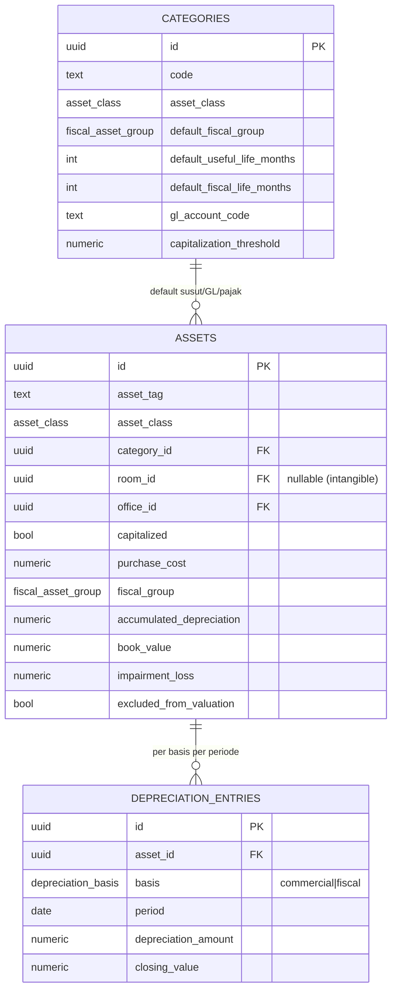
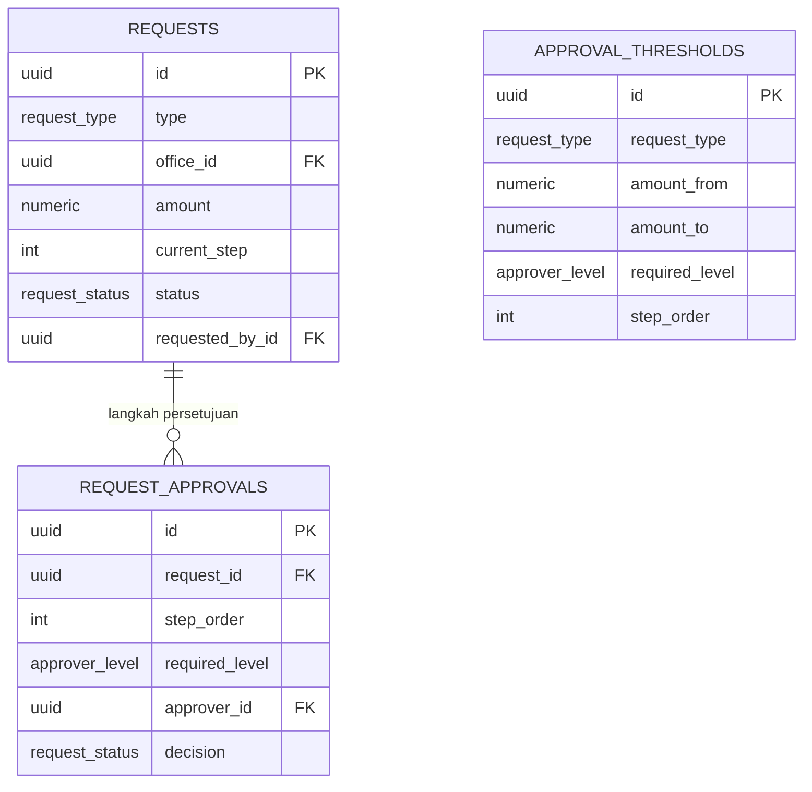
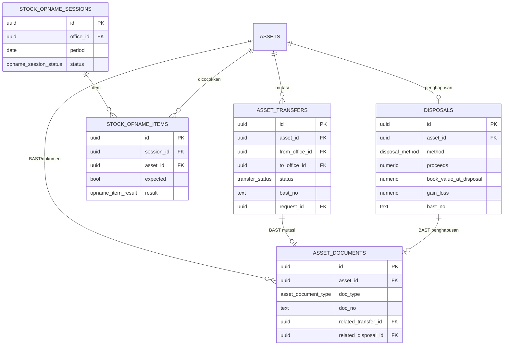

# Inventra — ERD (Entity Relationship Diagram)

| | |
|---|---|
| **Produk** | Inventra — Bank Fixed Asset Management System |
| **Database** | PostgreSQL 16 (schema-per-modul) |
| **Tanggal** | 2026-06-26 (selaras PRD v1.1 / DATABASE.md) |
| **Sumber kebenaran kolom** | [DATABASE.md](DATABASE.md) — dokumen ini fokus pada **relasi**; kamus kolom lengkap ada di sana |

> Dokumen pendukung yang merangkum **seluruh relasi antar-entitas** dalam satu tempat (diagram
> konsolidasi + per-domain). Untuk tipe enum, index, dan kamus data per kolom lihat
> [DATABASE.md](DATABASE.md). Entitas **🆕 v1.1** = penambahan konteks bank (mutasi, stock opname,
> BAST, penyusutan dua basis, disposal, limit otorisasi, intangible).

## Legenda

- `||--o{` satu-ke-banyak (wajib→opsional) · `||--o|` satu-ke-nol/satu · `}o--||` banyak-ke-satu
- **PK** primary key · **FK** foreign key · `?` nullable
- Semua tabel memakai `id uuid` PK + `created_at`/`updated_at`/`deleted_at` (soft delete) — lihat
  DATABASE.md bagian 1. Tabel append-only (`audit_logs`) hanya `created_at`.

---

## 1. Peta Schema (modul → tabel)

| Schema | Tabel |
|---|---|
| `identity` | roles, role_permissions, users, field_permissions, data_scope_policies, **app_settings** 🆕 |
| `audit` | audit_logs |
| `masterdata` | provinces, cities, office_types, departments, positions, vendors, brands, models, categories, maintenance_categories, problem_categories, units, offices, floors, rooms, employees |
| `asset` | assets, asset_attachments, asset_tag_counters, **asset_documents** 🆕 |
| `assignment` | assignments |
| `maintenance` | maintenance_schedules, maintenance_records |
| `depreciation` | depreciation_entries *(dua basis 🆕)* |
| `approval` | requests, **approval_thresholds** 🆕, **request_approvals** 🆕 |
| `import` | import_jobs |
| **`transfer`** 🆕 | asset_transfers |
| **`stockopname`** 🆕 | stock_opname_sessions, stock_opname_items |
| **`disposal`** 🆕 | disposals |

---

## 2. Diagram Konsolidasi (relasi inti)

```mermaid
erDiagram
  %% ---- Identity & Otorisasi ----
  ROLES                ||--o{ USERS               : "peran"
  ROLES                ||--o{ ROLE_PERMISSIONS    : "izin aksi"
  ROLES                ||--o{ FIELD_PERMISSIONS   : "per-field"
  ROLES                ||--o{ DATA_SCOPE_POLICIES : "lingkup data"
  EMPLOYEES            ||--o| USERS               : "tertaut"
  OFFICES              ||--o{ USERS               : "penempatan"
  USERS                ||--o{ AUDIT_LOGS          : "aktor"

  %% ---- Master data: geografi & kantor ----
  PROVINCES            ||--o{ CITIES              : "punya"
  PROVINCES            ||--o{ OFFICES             : "lokasi"
  CITIES               ||--o{ OFFICES             : "lokasi"
  OFFICE_TYPES         ||--o{ OFFICES             : "klasifikasi"
  OFFICES              ||--o{ OFFICES             : "parent (4 jenjang)"
  OFFICES              ||--o{ FLOORS              : "punya"
  FLOORS               ||--o{ ROOMS              : "punya"
  OFFICES              ||--o{ EMPLOYEES           : "menempatkan"
  DEPARTMENTS          ||--o{ EMPLOYEES           : "bagian"
  POSITIONS            ||--o{ EMPLOYEES           : "jabatan"
  BRANDS               ||--o{ MODELS              : "punya"

  %% ---- Aset (hub) ----
  CATEGORIES           ||--o{ ASSETS              : "klasifikasi + default susut/GL/pajak"
  BRANDS               ||--o{ ASSETS              : "merek"
  MODELS               ||--o{ ASSETS              : "model"
  ROOMS                ||--o{ ASSETS              : "lokasi (tangible)"
  OFFICES              ||--o{ ASSETS              : "scoping"
  UNITS                ||--o{ ASSETS              : "satuan"
  VENDORS              ||--o{ ASSETS              : "pemasok"
  EMPLOYEES            ||--o{ ASSETS              : "pemegang"
  ASSETS               ||--o{ ASSET_ATTACHMENTS   : "lampiran (MinIO)"
  ASSETS               ||--o{ ASSET_DOCUMENTS     : "BAST/dokumen 🆕"
  ASSETS               ||--o{ ASSIGNMENTS         : "penugasan"
  ASSETS               ||--o{ ASSET_TRANSFERS     : "mutasi 🆕"
  ASSETS               ||--o{ MAINTENANCE_SCHEDULES : "jadwal"
  ASSETS               ||--o{ MAINTENANCE_RECORDS : "catatan"
  ASSETS               ||--o{ DEPRECIATION_ENTRIES : "susut (2 basis 🆕)"
  ASSETS               ||--o{ STOCK_OPNAME_ITEMS  : "dicocokkan 🆕"
  ASSETS               ||--o| DISPOSALS           : "penghapusan 🆕"

  %% ---- Operasional ----
  EMPLOYEES            ||--o{ ASSIGNMENTS         : "custodian"
  MAINTENANCE_CATEGORIES ||--o{ MAINTENANCE_RECORDS : "kategori"
  PROBLEM_CATEGORIES   ||--o{ MAINTENANCE_RECORDS : "masalah"
  OFFICES              ||--o{ ASSET_TRANSFERS     : "asal/tujuan 🆕"
  OFFICES              ||--o{ STOCK_OPNAME_SESSIONS : "lingkup 🆕"
  STOCK_OPNAME_SESSIONS ||--o{ STOCK_OPNAME_ITEMS : "item 🆕"

  %% ---- Approval, Audit, Import ----
  USERS                ||--o{ REQUESTS            : "maker/pemutus"
  OFFICES              ||--o{ REQUESTS            : "routing"
  REQUESTS             ||--o{ REQUEST_APPROVALS   : "rantai berjenjang 🆕"
  USERS                ||--o{ REQUEST_APPROVALS   : "approver 🆕"
  REQUESTS             ||--o| ASSET_TRANSFERS     : "approval 🆕"
  REQUESTS             ||--o| DISPOSALS           : "approval 🆕"
  USERS                ||--o{ IMPORT_JOBS         : "pembuat"
```

> Catatan: `APPROVAL_THRESHOLDS` (limit otorisasi per nilai) dan `APP_SETTINGS` (config global)
> bersifat **konfigurasi**, bukan relasi entitas — tidak digambar sebagai FK. `approval_thresholds`
> dipilih berdasarkan `requests.type` + `requests.amount`; `app_settings` menyimpan default global
> (mis. batas kapitalisasi).

---

## 3. Diagram per Domain (dengan atribut kunci)

### 3.1 Aset sebagai hub + akuntansi/pajak

### 3.2 Approval berjenjang per nilai 🆕

> Alur: `requests.amount` + `type` dicocokkan ke band `approval_thresholds` → menghasilkan rantai
> `request_approvals` (berurutan). Eksekusi aksi nyata terjadi setelah langkah terakhir `approved`.
> SoD: tiap `approver_id` berbeda & ≠ maker (PRD bagian 2.4 / FR-6.4).

### 3.3 Mutasi, Stock Opname, Disposal & Dokumen 🆕

---

## 4. Catatan integritas lintas-entitas

- **Scoping** (`office_subtree`/`office`/`own`) ditegakkan di service layer pada **read & write**
  untuk assets, transfers, opname, disposals, requests — bukan hanya UI (PRD bagian 2.2).
- **Intangible**: `assets.room_id` NULL + CHECK (`asset_class='intangible' OR room_id IS NOT NULL`);
  dikecualikan dari barcode (`asset_tag` tetap ada) dan `stock_opname_items`.
- **Mutasi**: saat `asset_transfers.status='received'`, service memperbarui `assets.office_id`/`room_id`.
- **Disposal**: `disposals` UNIQUE per `asset_id`; saat final → `assets.status='disposed'`.
- **Penyusutan dua basis**: `depreciation_entries` UNIQUE `(asset_id, basis, period)`.
- **Soft delete + FK**: FK fisik umumnya `RESTRICT`; "cascade soft delete" ditangani service layer,
  kecuali `ON DELETE CASCADE` eksplisit (asset_attachments, stock_opname_items, request_approvals).

> Untuk daftar index lengkap, tipe enum, generator `asset_tag`, dan pemetaan migrasi
> (`000015`–`000021` untuk v1.1), lihat [DATABASE.md](DATABASE.md) bagian 2, bagian 4.6, bagian 4.7, bagian 6.
