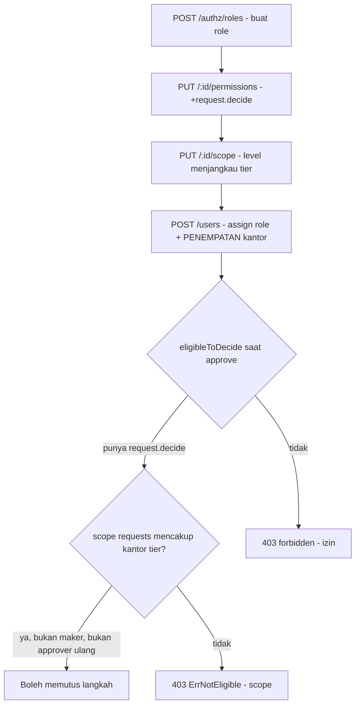

# Panduan Penentuan Approver (Maker-Checker)

Dokumen ini menjelaskan **bagaimana sistem menentukan siapa yang boleh memutus (approve/reject)
sebuah langkah persetujuan**, dan **cara membuat sebuah role baru menjadi approver** pada tier tertentu.
Semua aturan di sini bersumber dari kode (`internal/approval/service.go`, `internal/masterdata/common/`)
dan konfigurasi data-driven (`identity.*`), bukan asumsi.

Rujukan terkait: skenario konkret per modul ada di [ALUR_PENGGUNA.md](ALUR_PENGGUNA.md) **Lampiran A**;
mekanisme administrasi RBAC ada di bagian 16 dokumen yang sama.

Prinsip inti: **approver TIDAK di-hardcode.** Kelayakan seorang user ditentukan sepenuhnya oleh tiga
konfigurasi yang bisa diubah Superadmin lewat modul RBAC (`/authz`), plus aturan pemisahan fungsi (SoD)
yang ditegakkan saat runtime.

---

## 1. Model tiga lapis kelayakan approver

Seorang user boleh memutus **satu langkah** bila **keempat** syarat `eligibleToDecide`
(`internal/approval/service.go`) terpenuhi:

1. **Izin aksi `request.decide`** — digerbang di route (`middleware.RequirePermission`). Tanpa ini,
   akses ditolak sebelum logika kelayakan dijalankan.
2. **Bukan maker** request itu (SoD) — ditegakkan ganda: CHECK DB `decided_by_id <> requested_by_id`
   dan cek service. Pelanggaran ke **403** `ErrSelfApproval`.
3. **Bukan approver langkah sebelumnya** pada rantai yang sama (tidak boleh approver berulang) — **403**.
4. **Data scope-nya (modul `requests`) mencakup "kantor tier" langkah itu** — **403** `ErrNotEligible`
   bila tidak.

Syarat 1 dan 4 adalah **konfigurasi role** (bisa diatur). Syarat 2 dan 3 adalah **aturan per-request**
saat runtime (bukan konfigurasi). Konsekuensi penting: **punya `request.decide` saja TIDAK cukup** —
data scope harus menjangkau kantor tier. Ini kesalahan paling umum (lihat bagian 6).

> **Catatan modul scope:** kelayakan memutus memakai data-scope modul **`requests`**
> (`handler.go` memanggil `CallerOfficeScope(c, "requests")` pada `approve`/`reject`/`inbox`). Bila role
> tidak punya baris override modul `requests`, sistem memakai baris **default `*`**. Jadi mengatur
> `*` saja sudah cukup, kecuali Anda sengaja meng-override khusus modul `requests`.

---

## 2. Rantai langkah dibentuk dari band nilai (threshold)

Jumlah dan level langkah **tidak tetap** — dibangkitkan dari `approval_thresholds` sesuai `amount`
request (`MatchThresholdSteps`). Band bawaan (tersegel di migrasi `000016`/`000020`/`000026`/`000031`):

| Tipe request | Nilai (Rp) | Rantai langkah (level) |
|---|---|---|
| `asset_create` / `asset_import` | 0 - 10 jt | office |
| | 10 jt - 100 jt | office, wilayah |
| | 100 jt ke atas | office, wilayah, pusat |
| `asset_disposal` | 0 - 5 jt | office |
| | 5 jt - 50 jt | office, wilayah |
| | 50 jt ke atas | office, wilayah, pusat |
| `asset_transfer` | 0 - 50 jt | office |
| | 50 jt ke atas | office, wilayah |
| `assignment` (peminjaman) | berapa pun (amount 0) | office (satu langkah) |
| `maintenance` (laporan Staf) | berapa pun (amount 0) | office (satu langkah) |
| `valuation_exclusion` | berapa pun | wilayah (satu langkah) |

Setiap langkah punya `required_level` (`office` / `wilayah` / `pusat`). Level inilah yang menentukan
**kantor tier** yang harus dijangkau scope approver (bagian 3). Band bisa diubah Superadmin lewat CRUD
`/approval-thresholds` (`approval.config.manage`).

---

## 3. Resolusi "kantor tier" per level (`resolveTierOffice`)

| `required_level` | Kantor tier yang dituju | Scope yang mencakup |
|---|---|---|
| `office` / `office_subtree` | **Kantor asal** request (kantor aset/batch) | user ber-scope yang mencakup kantor itu: Kepala Unit/Manager kantor tsb, Kepala Kanwil di atasnya, pejabat Pusat, atau `global` |
| `wilayah` | Leluhur terdekat ber-tier `wilayah` | Kepala Kanwil wilayah itu (berkantor di wilayah), pejabat Pusat, atau `global` |
| `pusat` | Leluhur terdekat ber-tier `pusat` | Pejabat Kantor Pusat (berkantor di Pusat, scope `office_subtree`), atau `global` |

Tier kantor ditentukan dari `office_types.tier` (`pusat` / `wilayah` / `office`; cabang, KCP, dan kas
semuanya `office`). "Menjangkau" ditentukan kombinasi **level scope** + **penempatan kantor user**:
`office_subtree` dari kantor X mencakup X dan seluruh turunannya (ke bawah), **tidak** naik ke induk.
Karena itu Kepala Unit cabang tak bisa memutus langkah `wilayah` — subtree cabang tak naik ke wilayah.

Superadmin **sengaja dikecualikan** sebagai approver bisnis: meski scope `global`-nya secara teknis
mencakup semua tier, ia diperlakukan akun sistem (lihat Lampiran A.2). Tier `pusat` diperankan role
bisnis (pejabat Kantor Pusat), bukan superadmin.

---

## 4. Cara membuat sebuah role baru menjadi approver

Seluruhnya **data-driven lewat modul RBAC** (`/authz`) — tanpa perubahan kode/migrasi. Empat langkah:

### Langkah 1 — Buat role
```json
POST /api/v1/authz/roles
{ "code": "approver_wilayah_khusus", "name": "Approver Wilayah Khusus",
  "description": "Memutus persetujuan tingkat wilayah" }
```

### Langkah 2 — Beri izin `request.decide` (replace-set)
Sertakan **semua** izin yang ingin dipertahankan (semantik replace-set):
```json
PUT /api/v1/authz/roles/{id}/permissions
{ "permissions": ["request.decide", "asset.view", "report.view"] }
```
Untuk juga bisa **mengajukan** request, tambahkan `request.create`. Approver tier pusat yang merangkap
operasional penyusutan bisa diberi `depreciation.manage` (lihat catatan Lampiran A.2).

### Langkah 3 — Set data scope (modul `requests` atau default `*`)
Pilih level yang **menjangkau kantor tier** yang ingin diputus:
```json
PUT /api/v1/authz/roles/{id}/scope
{ "policies": [ { "module": "*", "scope_level": "office_subtree" } ] }
```
- Approver tier **office/wilayah**: `office_subtree` sudah cukup — cakupannya bergantung penempatan
  kantor user (Langkah 4).
- Approver tier **pusat**: `office_subtree` **dengan user berkantor di Kantor Pusat** (subtree Pusat
  mencakup Pusat sendiri), atau `global`.
Anda boleh meng-override khusus modul `requests` bila ingin scope keputusan berbeda dari modul lain.

### Langkah 4 — Assign user ke role DAN tempatkan di kantor yang tepat
Ini bagian yang paling sering keliru: "menjangkau tier" = **level scope** (Langkah 3) **×** **kantor
tempat user berkantor**.
```json
POST /api/v1/users
{ "name": "...", "email": "...", "password": "...",
  "role_id": "{id}", "office_id": "{kantor yang benar}", "employee_id": "..." }
```
- Approver tier **office** untuk cabang X → user berkantor di **X** (atau leluhurnya) dengan
  `office_subtree`.
- Approver tier **wilayah** W → user berkantor di **W** (atau Pusat) dengan `office_subtree`, atau
  `global`.
- Approver tier **pusat** → user berkantor di **Kantor Pusat** dengan `office_subtree`, atau `global`.

Contoh nyata yang sudah dipakai: role **`pejabat_pusat`** (seed demo / Lampiran A) = `request.decide` +
scope `office_subtree`, user berkantor di Kantor Pusat → otomatis memenuhi tier `pusat` **dan** `wilayah`
(subtree Pusat mencakup keduanya), tanpa satu baris kode pun.

### Diagram alur konfigurasi



---

## 5. Kesalahan umum dan catatan tata kelola

- **Izin tanpa scope** — memberi `request.decide` tapi scope tak menjangkau kantor tier → tetap **403**
  `ErrNotEligible`. Selalu cek Langkah 3 **dan** 4 bersama.
- **Scope benar, penempatan salah** — user ber-scope `office_subtree` tapi berkantor di kantor yang
  salah (mis. approver pusat tapi user berkantor di cabang) → subtree-nya tak mencakup tier pusat → 403.
- **Approver berulang** — orang yang lebih tinggi boleh memutus langkah lebih rendah, tetapi begitu ia
  memakai satu langkah, ia tak boleh dipakai lagi di langkah berikutnya. Rantai 3 langkah wajib diputus
  **tiga orang berbeda**.
- **Maker tak boleh memutus** permohonannya sendiri (SoD) — selalu 403, bahkan bila scope-nya mencakup.
- **Superadmin dikecualikan dari peran approver bisnis** — akun sistem; jangan ditugaskan ke pegawai.
  Kebutuhan tier pusat diperankan role bisnis (pejabat Kantor Pusat).
- **Inbox mencerminkan kelayakan** — `GET /requests/inbox` hanya menampilkan langkah yang boleh diputus
  pemanggil (memakai `eligibleToDecide` yang sama), jadi bila sebuah request tak muncul di inbox
  seseorang, kemungkinan besar scope/penempatannya belum tepat.
- **Invalidasi cache** — konfigurasi RBAC di-cache Redis per `role_id`; mutasi lewat `/authz`
  meng-invalidasi cache otomatis. Perubahan langsung via SQL (mis. seed) **tidak** — flush manual
  (`redis-cli FLUSHALL` di dev) diperlukan.

---

## 6. Referensi kode

- Kelayakan: `internal/approval/service.go` — `eligibleToDecide`, `resolveTierOffice`, `Decide`, `Inbox`.
- Scope: `internal/masterdata/common/scope.go` — `OfficeScopeFor`, `CallerOfficeScope`, `InScope`.
- Gerbang izin: `internal/middleware/permission.go` — `RequirePermission`.
- Band nilai: tabel `approval.approval_thresholds` (migrasi `000016`/`000020`/`000026`/`000031`).
- Administrasi RBAC: `internal/authzadmin` + [ALUR_PENGGUNA.md](ALUR_PENGGUNA.md) bagian 16.
- Skenario konkret siapa-boleh-apa per modul: [ALUR_PENGGUNA.md](ALUR_PENGGUNA.md) **Lampiran A**.
